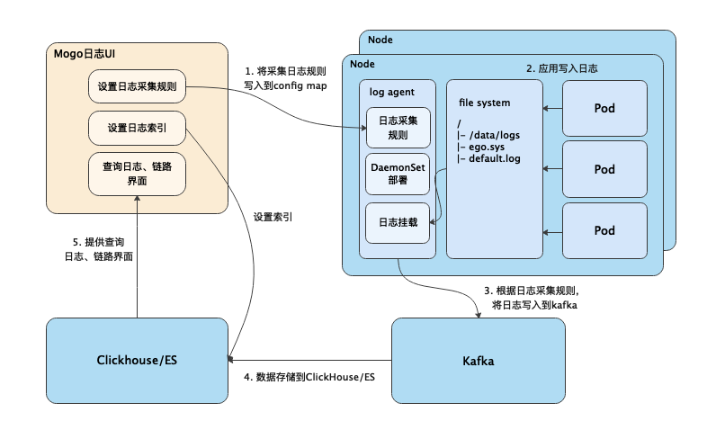

# mogo

[](https://goreportcard.com/report/github.com/shimohq/mogo)
[](https://github.com/shimohq/mogo)
[](https://github.com/shimohq/mogo/blob/master/LICENSE)

[English](https://github.com/shimohq/mogo/blob/master/README.md) | [中文](https://github.com/shimohq/mogo/blob/master/README-CN.md)

Mogo is a lightweight browser-based logs analytics and logs search platform for some datasource(ClickHouse or MySQL).

- log search page


- configuration page


## Features

- visual query dashboard, support query Histogram and raw logs for SQL.
- shows percentage for specified fields.
- vscode style configuration board, you can easily emit your fluent-bit configuration to Kubernetes ConfigMap.
- Out of the box, easily deployment with `kubectl`.
- Support for GitHub and GitLab Authentication.

## Architecture


## Installation

- For Docker

```bash
# clone mogo source code.
git clone https://github.com/shimohq/mogo.git

# you may need to set docker image mirror, visit <https://github.com/yeasy/docker_practice/blob/master/install/mirror.md> for details.
docker-compose up

# then go to browser and visit http://localhost:9001.
# login username: admin
# login password: admin
```

- For host

```bash
# download release.
# get latest version.
latest=$(curl -sL https://api.github.com/repos/shimohq/mogo/releases/latest | grep  ".tag_name" | sed -E 's/.*"([^"]+)".*/\1/')

# for MacOS amd64.
wget "https://github.com/shimohq/mogo/releases/download/${latest}/mogo-${latest}-darwin-amd64.tar.gz" -O mogo-${latest}.tar.gz 

# for Linux amd64.
wget "https://github.com/shimohq/mogo/releases/download/${latest}/mogo-${latest}-linux-amd64.tar.gz" -O mogo-$(latest).tar.gz  

# extract zip file to current directory.
mkdir -p ./mogo-${latest} && tar -zxvf mogo-${latest}.tar.gz -C ./mogo-${latest}

# open config/default.toml, then change database and redis or other section configuration
# execute migration latest sql script in scripts/migration directory
# start mogo
cd ./mogo-${latest} && ./mogo -config config/default.toml

# then go to browser and visit http://localhost:9001
# login username: admin
# login password: admin
```

## Main Tasks

## Bugs or features

If you want to report a bug or request for a feature, create a issue [here](https://github.com/shimohq/mogo/issues).

## Contributors
