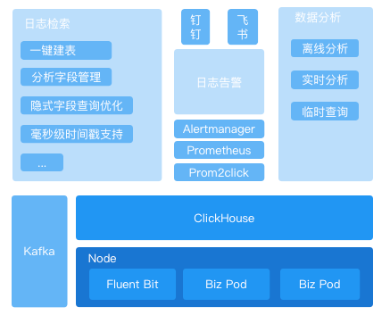

# Q&A

## Is there any ClickVisual performance test report, Especially the comparison test with ELK in the same scale?
Clickvisual is the GUI tool of Clickhouse to help users quickly build Clickhouse.
For performance test comparison, you can pay attention to the following articles about the differences between Clickhouse And ES.

- [https://mp.weixin.qq.com/s/hP0ocT-cBCeIl9n1wL_HBg](https://mp.weixin.qq.com/s/hP0ocT-cBCeIl9n1wL_HBg)
- [https://mp.weixin.qq.com/s/n2I94X6tz2jOABzl1djxYg](https://mp.weixin.qq.com/s/n2I94X6tz2jOABzl1djxYg)

## Which components are required?
You can refer to this figure. Clickvisual is roughly divided into the following three modules. Each module uses different components and can be used optionally.
- Log query
- Log alarm
- Data analysis



## Whether the component can use the existing one instead of creating a new one?
You can use existing components without creating them completely. For example, when ClickHouse uses an existing component to create a database, there may be a duplicate name problem. At this time, ClickVisual will fail to create the database.

## Currently, it can only be used in the test environment? Is there  any cluster version in the production environment?
We have used it internally in the production environment, and both self built clusters and Alibaba cloud clusters are in normal use.

## Which enterprises have used the log platform at present?
You can refer to the issues, which are filled in by the user spontaneously [https://github.com/clickvisual/clickvisual/issues/154](https://github.com/clickvisual/clickvisual/issues/154)

## The problem that jump to localhost after service startup.

Problem


How to fix it

Find default.toml and update the rootURL value.
```toml
[app]
rootURL = "http://localhost:19001"
 ```
- The rootURL here must be prefixed with http://

How to find default.toml:
- docker：/data/all-in-one/clickvisual/config/docker.toml
- Code start：/config/default.toml

## The problem that Kafka has data but ClickVisual has no log.

Problem

It can be seen in Kowl that there is data in topics,but no data is available in ClickVisual while ClickHouse instance is created in ClickVisual and database list is added to the log and log library is added. How do I see if the data has reached ClickHouse?


Troubleshooting


View this steam_sql structure ensures that the log data transferred in Kafka is a subset of the above structure, as shown in the following figure.

For example, the above two cannot correspond, the field `_ time_` of steam_sql structure in ClickHouse is String type while in Kafka is float type.In this case, data cannot be consumed normally.

This configuration can be set here


How to fix it

1. Adjust the Kafka collected data content to ensure that the Kafka collected data fields are subsets of the fields in the stream table.
2. Adjust `kafka_ skip_ broken_ Messages` parameter, skipping data with abnormal format
   
Log data in Kafka needs to be guaranteed to be :

> `_time_`: string or float   
> `_log_`: original log


## There is no SQL for creating tables in database.sql?

Your can initialize database by access http://localhost:19001 after service startup.
