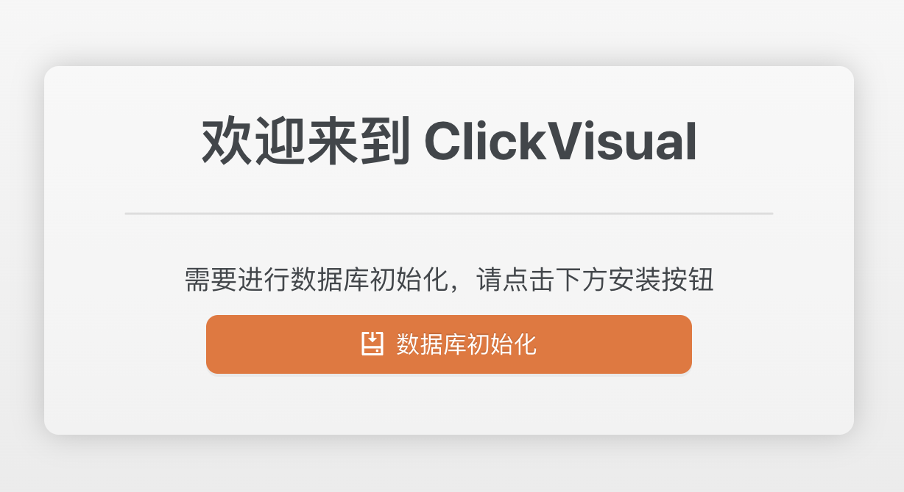
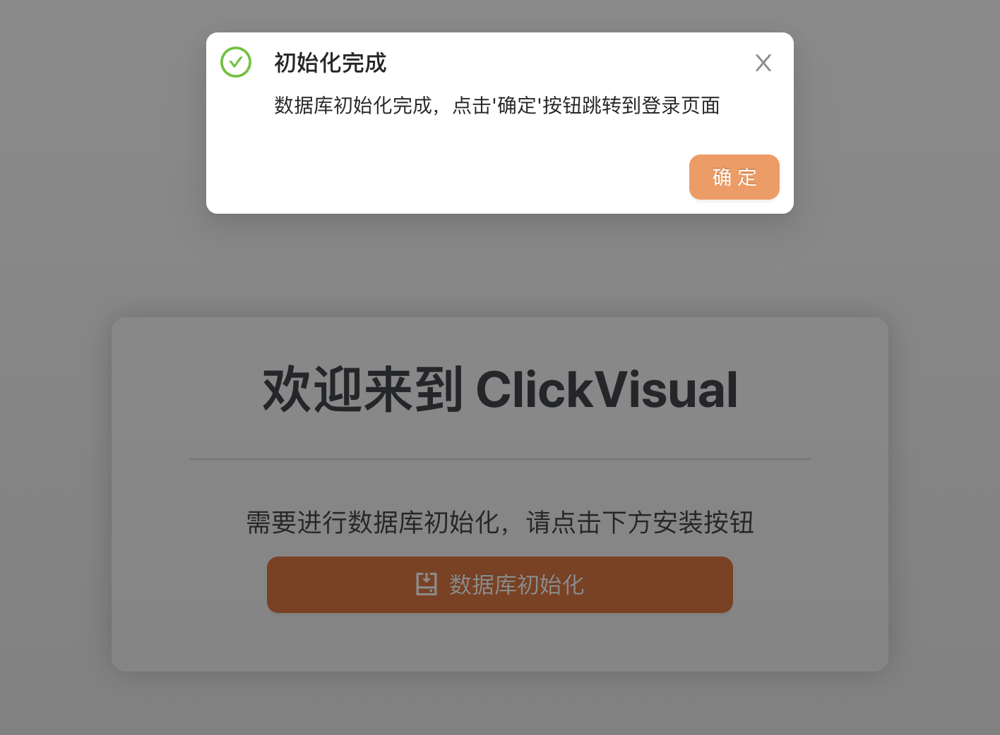
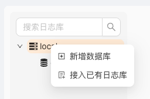

# Quick Start
This article is mainly to help you quickly start. To learn more about clickvisual, please refer to: [What is ClickVisual](https://github.com/clickvisual/clickvisual-doc/blob/master/docs/en/clickvisual/01quickstart/what-is-the-clickvisual.md)

## Step 1 ClickVisual

- Clickvisual can be installed on different operating systems, and can be installed in binary and docker forms. Please refer to the installation introduction.

## Step 2 ClickVisual database
- To install clickvisual for the first time, you need to initialize the database,access http://localhost:19001/install/init
- When updating the version of an existing database,access http://localhost:19001/api/v1/migration

- Click the "Database initialization" button and wait for a while until the page prompts that the initialization is complete.

## Step 3: Login
Access http://localhost:19001/user/login
On the login page, enter the default account / password: clickvisual/clickvisual

## Step 4: Add ClickHouse instance
- In the top navigation bar, access  Setting - > Instances,click 'Add instance' button to add a new ClickHouse instance.
- Set the DSN address of the ClickHouse instance to be added.
- In the top navigation bar, access  Logs - > and click 'Switch Database' button image.png , select the ClickHouse instance just added and set up the database.

## Step 5: Create a log library 
- create table：ingress_stdout
- Select the time type of the collection log. The collection log is marked as_ time_. The type can be string or float
- Log Retention Days: seven days
- Brokers：Fill in the Kafka configuration in docker: kafka:9092
- Topic: The topic name of the collection log in Kafka is inress-stdout

## Step 6: Generate some logs for demo
- Access http://127.0.0.1:19003 several times

## Step 7: Query logs
- Access http://localhost:19001/query 

- Create index
Since the index has not been created, the background color of all fields is gray. At this time, we can only use fuzzy search, but the performance is not very good. Therefore, we need to create the index according to the following figure.

After the index is created, we can insert several logs according to step 5 to view the logs according to the index:

