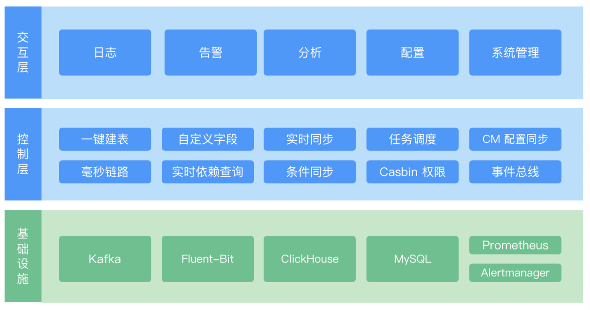
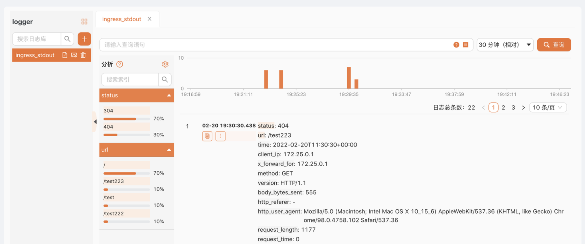
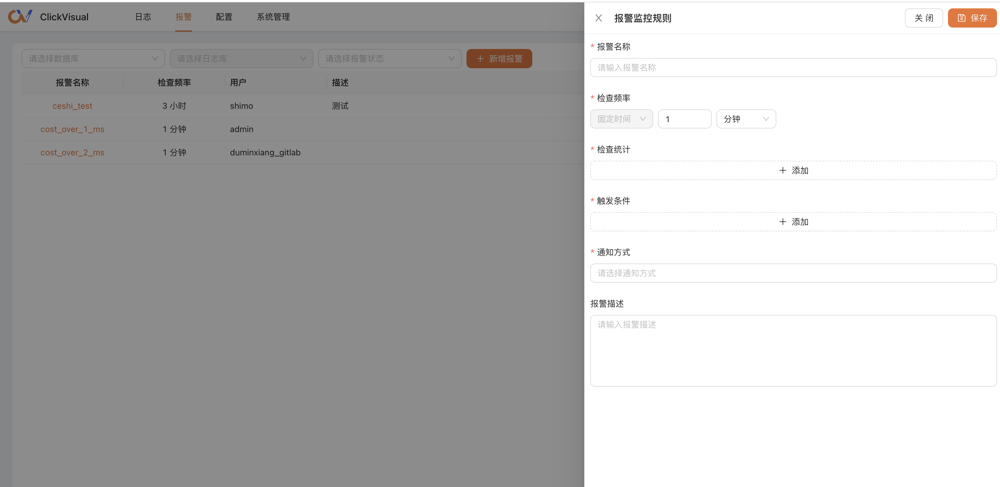
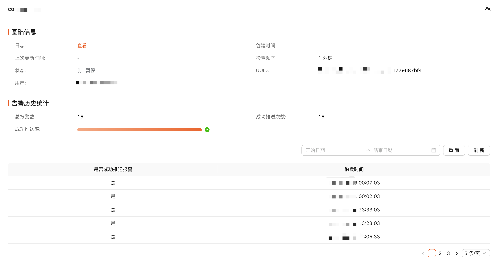

# What is ClickVisual

ClickVisual is a lightweight and open-source visual platform for log query, analysis and alarm. It is committed to providing a visual solution for one-stop application reliability. It can be deployed independently or integrated into a third-party system as a plug-in. At present, it is the only kibana like business log query platform that supports ClickHouse in the market.

## Features
- ClickVisual has  visual  panels to query hit histogram and original log.
- ClickVisual supports the function of setting log indexes and analyzing the proportion of different indexes.
- The visual VS code style configuration center can easily synchronize the logagent configuration to the kubernetes cluster configmap.
- Support GitHub and gitlab authorized login.
- ClickVisual supports Proxy Auth function and can be easily integrated into third-party systems.
- Support physical machine, docker and kubernetes deployment.
- Support real-time alarm function based on ClickHouse log.

## Technical architecture

## ClickVisual UI

### Log query

### Visual configuration

### Adding alarm rule

### Alarms history

### Use Case Scenarios
- Log query
- Log alarm
- Configuration delivery
- Quick integration
