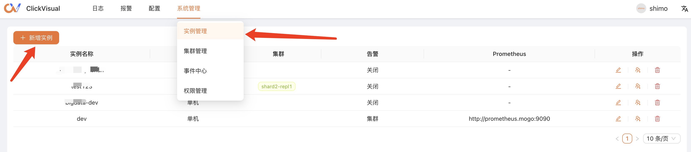
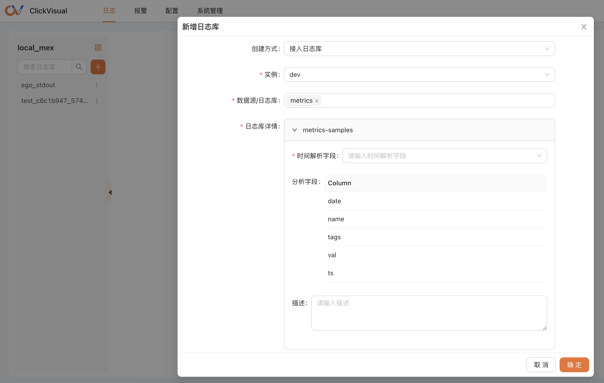

# Access existing tables 

`Available version >= 0.2.2`

Add an instance in Setting.

In the top navigation bar, access  Logs - > and click 'Creating a Log library' button,change 'Creation Mode' to 'Select an existing log library'.Time Resolution Field is the log data timeline field,the optional types are `DateTime64(3)`、`DateTime`、`Int32`、`Int64`.The target data table needs to contain one of the fields before it can be accessed normally.

