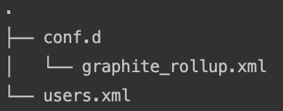
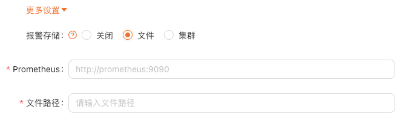
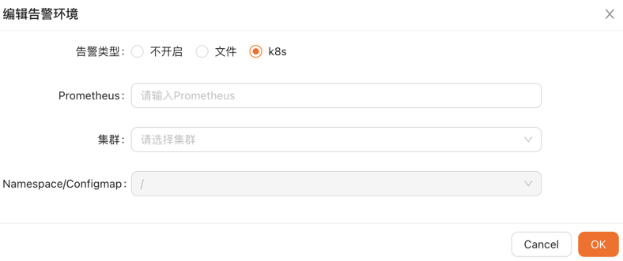

# Alarm function configuration

`Available version >= 0.2.1`

## Architecture 


## Instructions

1. Generate Materialized View of the corresponding data table in ClickHouse to enter data into metrics.samples in seconds according to the configured rules.
2. Write the generated Prometheus alarm rules to the configured file or configmap.
3. Prometheus reads data from metrics.samples, generate alarms according to alarm rules, and push them to Prometheus AlertManager.
4. Prometheus Alertmanager is pushed to ClickVisual through webhook, and then ClickVisual distributes it to third party communication platform such as DingDing.

## Cluster deployment

Refer to the config:[https://github.com/clickvisual/clickvisual/tree/master/data/k8s/prometheus](https://github.com/clickvisual/clickvisual/tree/master/data/k8s/prometheus)

### ClickHouse Config

Newly add `graphite_rollup` configuration,the configuration path can be slightly different according to the version of ClickHouse, and the specific configuration shall be subject to the official guidance.



```xml
<?xml version="1.0" ?>
<yandex>
    <graphite_rollup>
        <path_column_name>tags</path_column_name>
        <time_column_name>ts</time_column_name>
        <value_column_name>val</value_column_name>
        <version_column_name>updated</version_column_name>
        <default>
            <function>avg</function>
            <retention>
                <age>0</age>
                <precision>10</precision>
            </retention>
            <retention>
                <age>86400</age>
                <precision>30</precision>
            </retention>
            <retention>
                <age>172800</age>
                <precision>300</precision>
            </retention>
        </default>
    </graphite_rollup>
</yandex>
```
You need to create etrics.samples with `graphite_ Rollup` configuration

```sql
CREATE DATABASE IF NOT EXISTS metrics;
CREATE TABLE IF NOT EXISTS metrics.samples
(
    date Date DEFAULT toDate(0),
    name String,
    tags Array(String),
    val Float64,
    ts DateTime,
    updated DateTime DEFAULT now()
)ENGINE = GraphiteMergeTree(date, (name, tags, ts), 8192, 'graphite_rollup');
```

### prom2click config

prom2click repository：[https://github.com/mindis/prom2click](https://github.com/mindis/prom2click)

Modify the service startup parameter, -ch.dsn parameter to ensure that the service can access the ClickHouse.

### Prometheus config

Add the following configuration in the startup file:

- prom2click (corresponding service address)
- alertmanager (corresponding service address)

```yaml
alerting:
  # Alarm configuration file
  alertmanagers:
  # Modify: using static binding
  - static_configs:
    # Modify: targets, specified address and port
    - targets: ["alertmanager:9093"]
remote_read:
  - url: "http://prom2click:9201/read"
    read_recent: true
remote_write:
  - url: "http://prom2click:9201/write"
    queue_config:
      capacity: 10000
      max_shards: 1
      max_samples_per_send: 500
```

### Prometheus AlertManager Config

If the alarm mode is webhook, it calls back to the ClickVisual service. So you need change the url address to ensure normal access to the ClickVisual service.

```yaml
route:
  group_by: ['alertname', 'cluster', 'service']
  group_wait: 30s
  group_interval: 5m
  repeat_interval: 10m
  receiver: webhook

receivers:
- name: 'webhook'
  webhook_configs:
  - url: 'http://clickvisual:9001/api/v1/prometheus/alerts'
```

### ClickVisual Config

In the top navigation bar access:Setting -> Instances

In Create/edit instance modal,click "More Options",you can see the config to send alarm rules to Prometheus.

If Prometheus is started in the local configuration file mode, such as the following example, configure the file path as `/etc/prometheus/rules`

```yaml
rule_files:
- /etc/prometheus/rules/*.yaml
```



If deployed in k8s mode, this configmap is the location where the rules are stored.


Alarm message push effect display


