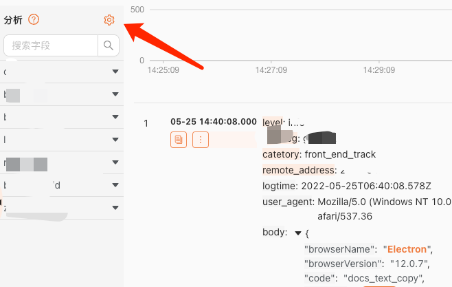
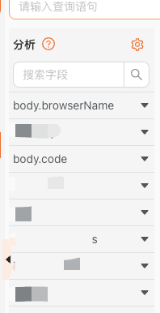
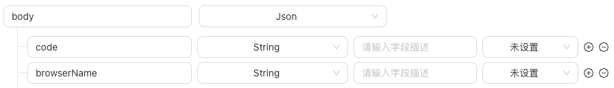
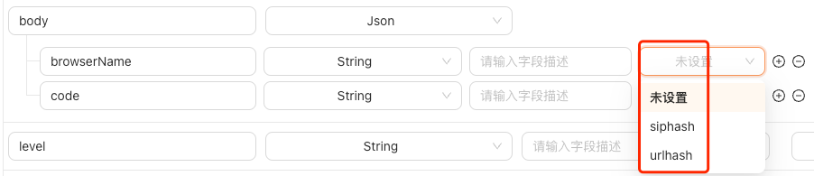

# Instructions

ClickHouse native Where clause syntax used in the log query criteria filter section.

[Official documents](https://clickhouse.com/docs/en/sql-reference/statements/select/where)

## Use cases after migration from Alibaba cloud

For example,we used to use  Alibaba cloud's fuzzy matching to search.The following statement will perform fuzzy matching on these two conditions.

`Electron and docs_text_copy`

So how to use it in ClickVisual? By default(establish a complete set of data collection process through clickVisual),use the following statement instead.

`_raw_log_ like '%Electron%' and _raw_log_ like '%docs_text_copy%'`

However, this performance is not very good,you can add Analysis fields to improve query efficiency.
Suppose that the target field we match is in a nested JSON: browserName and code field in body as shown below

If you see the following config in Analysis panel on the left,you can directly use  the following statement to query.

`body.browserName='browserName' and body.code='docs_text_copy'`

If there is no any Analysis field,you need to configure.

After configuration, the query statement is:

`body.browserName='browserName' and body.code='docs_text_copy'`

If the query is still slow in this case,you can configure that:set siphash and urlhash(truncate parameters after '?'and hash).By establishing hash mapping, query efficiency is improved.

The query statement is still:

`body.browserName='browserName' and body.code='docs_text_copy'`