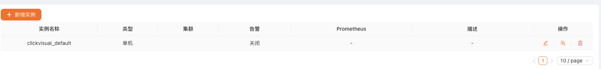
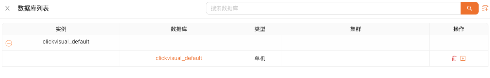
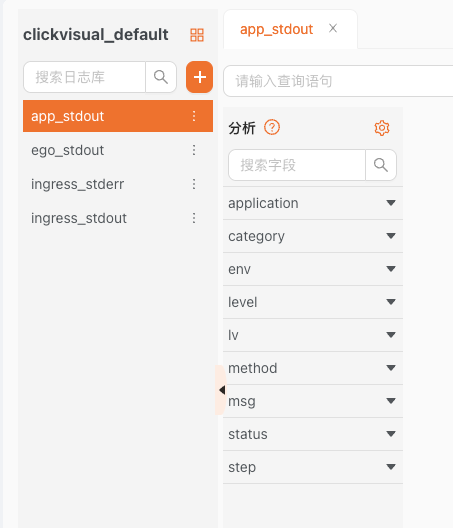

# Template Generation

## Initialize ego log templates

The `ego` command creates the ClickHouse instance, the `logger` database, and the log table templates. Use the repository's runtime config and init TOML file:

```bash
./bin/clickvisual ego \
  --config=./config/default.toml \
  --init-config=./config/init-config.example.toml
```

The init file is TOML. Provide the ClickHouse DSN with `clickhouse_dsn` or `--clickhouse-dsn`; Kafka brokers and topics can likewise be set in TOML or with their flags.

### ClickHouse cluster

`cluster` is a name from ClickHouse `system.clusters`. It is not a Kubernetes cluster name or a node list. Uncomment it in TOML when cluster mode is needed:

```toml
clickhouse_dsn = "tcp://localhost:9000?database=default&username=default&password="
# ClickHouse cluster name; uncomment to enable cluster mode
# cluster = "shard2-repl1"
```

Or pass it on the command line (a non-empty CLI value wins over TOML, after TrimSpace):

```bash
./bin/clickvisual ego --config=./config/default.toml \
  --init-config=./config/init-config.example.toml \
  --cluster=shard2-repl1
```

If `cluster` is omitted or empty, ego remains in standalone mode and does not query `system.clusters`. An explicit cluster is validated before the logger database and tables are created: an unknown name, query error, or `1 shard × 1 replica` topology fails; a cluster with multiple shards or multiple replicas passes. `--dry-run` only parses configuration and prints a summary—no ClickHouse connection or validation and no DDL are performed. DSN logs show only `configured` or `not configured`, never credentials.

### topic
Log topics come from `topics_app`, `topics_ego`, `topics_ingress_stdout`, and `topics_ingress_stderr` in the init TOML or from the corresponding command-line flags. If omitted, ego uses these built-in defaults:

```toml
topics_app = "app-stdout-logs-ilogtail"
topics_ego = "ego-stdout-logs-ilogtail"
topics_ingress_stdout = "ingress-stdout-logs-ilogtail"
topics_ingress_stderr = "ingress-stderr-logs-ilogtail"
```


### Results
- Created a ClickHouse instance record
- Created the `logger` database (using the optional cluster setting)
- Created app, ego, and ingress stdout/stderr log tables and consumption templates
- Wrote log-table metadata and analysis fields







