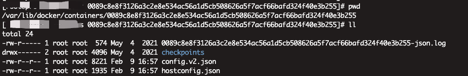
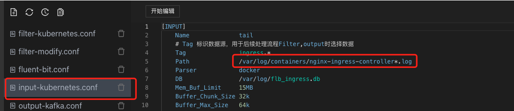
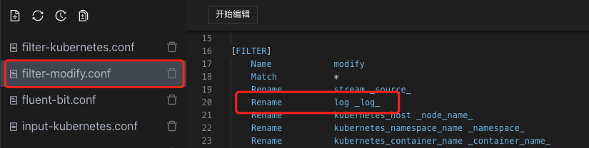
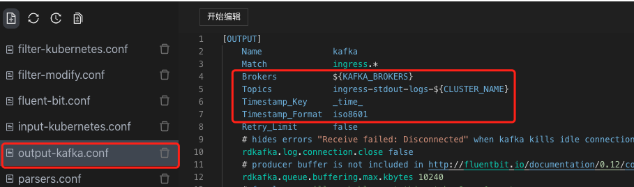
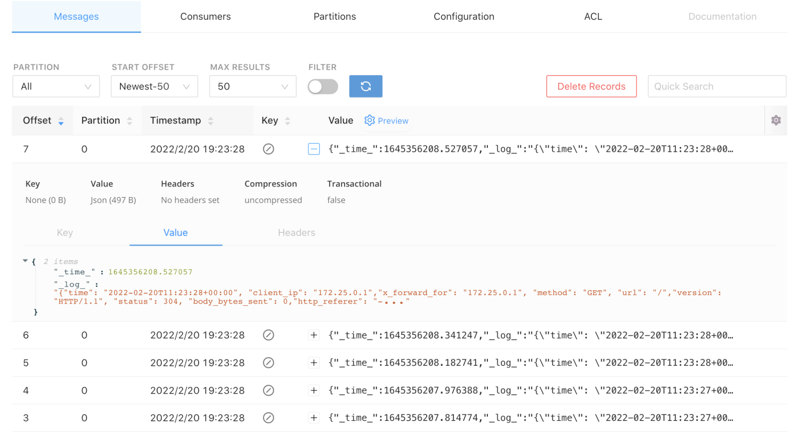
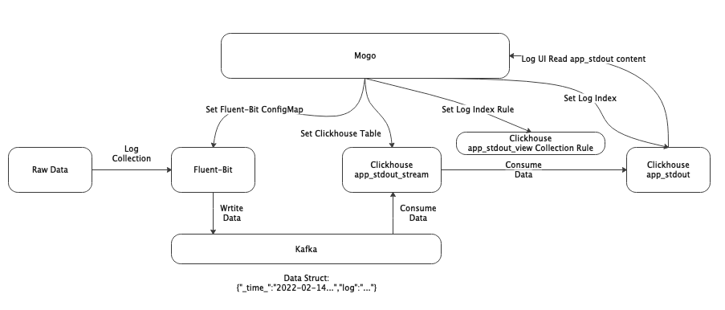
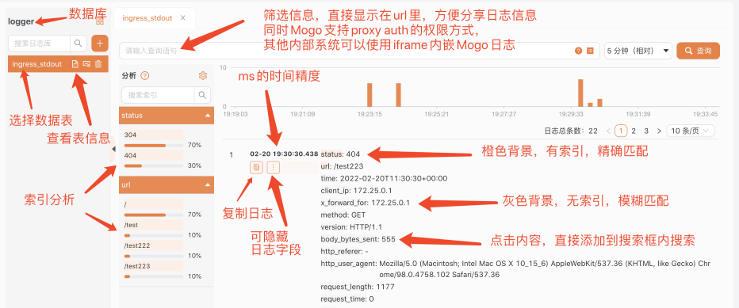
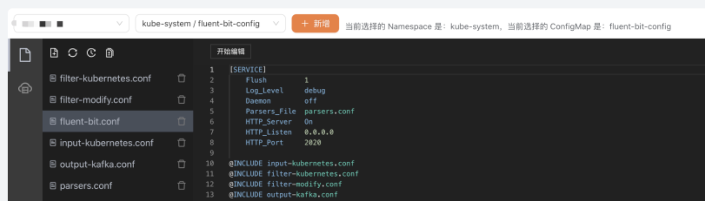

# 石墨文档日志架构

## 1. 背景
石墨文档全部应用部署在Kubernetes上，每时每刻都会有大量的日志输出，我们之前主要使用SLS和ES作为日志存储。但是在使用这些组件的时候，发现了一些问题。

成本问题： 
- SLS个人觉得是一个非常优秀的产品，速度快，交互方便，但是SLS索引成本比较贵 
- 我们想减少SLS索引成本的时候，发现云厂商并不支持分析单个索引的成本，导致我们无法知道是哪些索引构建的不够合理 
- ES使用的存储非常多，并且耗费大量的内存 
- 通用问题： 
- 如果业务是混合云架构，或者业务形态有SAAS和私有化两种方式，那么SLS并不能通用 
- 日志和链路，需要用两套云产品，不是很方便 
- 精确度问题：SLS存储的精度只能到秒，但我们实际日志精度到毫秒，如果日志里面有traceid，SLS中无法通过根据traceid信息，将日志根据毫秒时间做排序，不利于排查错误 

经过详细调研后，我们发现使用ClickHouse能够很好的解决以上问题，并且ClickHouse省存储空间，非常省钱，所以我们选择了ClickHouse方案存储日志。但当我们深入研究后，ClickHouse作为日志存储有许多落地的细节，但业界并没有很好阐述相关ClickHouse采集日志的整套流程，以及没有一款优秀的ClickHouse日志查询工具帮助分析日志，为此我们写了一套ClickHouse日志系统贡献给开源社区，并将ClickHouse的日志采集架构的经验做了总结。先上个ClickHouse日志查询界面，让大家感受下石墨最懂前端的后端程序员。


## 2. 架构原理

我们将日志系统分为四个部分：日志采集、日志传输、日志存储、日志管理。

- 日志采集：LogCollector采用Daemonset方式部署，将宿主机日志目录挂载到LogCollector的容器内，LogCollector通过挂载的目录能够采集到应用日志、系统日志、K8S审计日志等
- 日志传输：通过不同Logstore映射到Kafka中不同的Topic，将不同数据结构的日志做了分离
- 日志存储：使用Clickhouse中的两种引擎数据表和物化视图
- 日志管理：开源的clickvisual系统，能够查询日志，设置日志索引，设置LogCollector配置，设置Clickhouse表，设置报警等


以下我们按照这四大部分，阐述其中的架构原理


## 3. 日志采集

### 3.1. 采集方式

Kubernetes容器内日志收集的方式通常有以下三种方案

- DaemonSet 方式采集：在每个 node 节点上部署LogCollector，并将宿主机的目录挂载为容器的日志目录，LogCollector读取日志内容，采集到日志中心。 
- 网络方式采集：通过应用的日志 SDK，直接将日志内容采集到日志中心 。
- SideCar 方式采集：在每个 pod 内部署 LogCollector，LogCollector只读取这个 pod 内的日志内容，采集到日志中心。

以下是三种采集方式的优缺点：

DaemonSet方式网络方式SideCar方式采集日志类型标准输出+文件应用日志部署运维一般，维护DaemonSet低，维护配置文件日志分类存储可通过容器/路径等映射业务独立配置支持集群规模取决于配置数无限制适用场景日志分类明确、功能较单一性能要求极高的场景资源消耗中低

我们主要采用DaemonSet方式和网络方式采集日志。DaemonSet方式用于ingress、应用日志的采集，网络方式用于大数据日志的采集。以下我们主要介绍下DeamonSet方式的采集方式。

### 3.2.日志输出
从上面的介绍中可以看到，我们的DaemonSet会有两种方式采集日志类型，一种是标准输出，一种是文件。 引用元乙的描述：虽然使用 Stdout 打印日志是 Docker 官方推荐的方式，但大家需要注意：这个推荐是基于容器只作为简单应用的场景，实际的业务场景中我们还是建议大家尽可能使用文件的方式，主要的原因有以下几点：

- Stdout 性能问题，从应用输出 stdout 到服务端，中间会经过好几个流程（例如普遍使用的JSON LogDriver）：应用 stdout -> DockerEngine -> LogDriver -> 序列化成 JSON -> 保存到文件 -> Agent 采集文件 -> 解析 JSON -> 上传服务端。整个流程相比文件的额外开销要多很多，在压测时，每秒 10 万行日志输出就会额外占用 DockerEngine 1 个 CPU 核；
- Stdout 不支持分类，即所有的输出都混在一个流中，无法像文件一样分类输出，通常一个应用中有 AccessLog、ErrorLog、InterfaceLog（调用外部接口的日志）、TraceLog 等，而这些日志的格式、用途不一，如果混在同一个流中将很难采集和分析；
- Stdout 只支持容器的主程序输出，如果是 daemon/fork 方式运行的程序将无法使用 stdout；
- 文件的 Dump 方式支持各种策略，例如同步/异步写入、缓存大小、文件轮转策略、压缩策略、清除策略等，相对更加灵活。

从这个描述中，我们可以看出在docker中输出文件在采集到日志中心是一个更好的实践。绝大部分日志采集工具都支持采集文件日志方式，但是我们在配置日志采集规则的时候，发现开源的一些日志采集工具，例如fluentbit、filebeat在DaemonSet部署下采集文件日志是不支持追加例如pod、namespace、container_name、container_id 等 label信息，并且也无法通过这些label做些定制化的日志采集。

agent 类型采集方式daemonset部署sidecar部署ilogtail文件日志能够追加label信息，能够根据label过滤采集能够追加label信息，能够根据label过滤采集fluentbit文件日志无法追加label信息，无法根据label过滤采集能够追加abel信息，能够根据label过滤采集filebeat文件日志无法追加label信息，无法根据label过滤采集能够追加label信息，能够根据label过滤采集ilogtail标准输出能够追加label信息，能够根据label过滤采集能够追加label信息，能够根据label过滤采集fluentbit标准输出能够追加label信息，能够根据label过滤采集能够追加abel信息，能够根据label过滤采集filebeat标准输出能够追加label信息，能够根据label过滤采集能够追加label信息，能够根据label过滤采集

基于无法追加label信息的原因，我们暂时放弃了DeamonSet部署下文件日志采集方式，采用的是基于DeamonSet部署下标准输出的采集方式。

### 3.3. 日志目录

以下列举了日志目录的基本情况

目录描述类型/var/log/containers存放的是软链接，软链到/var/log/pods里的标准输出日志标准输出/var/log/pods存放标准输出日志标准输出/var/log/kubernetes/master存放Kubernetes 审计输出日志标准输出/var/lib/docker/overlay2存放应用日志文件信息文件日志/var/run获取docker.sock，用于docker通信文件日志/var/lib/docker/containers用于存储容器信息两种都需要

因为我们采集日志是使用的标准输出模式，所以根据上表我们的LogCollector只需要挂载/var/log，/var/lib/docker/containers两个目录。

#### 3.3.1 标准输出日志目录
应用的标准输出日志存储在/var/log/containers目录下，文件名是按照K8S日志规范生成的。这里以nginx-ingress的日志作为一个示例。我们通过ls /var/log/containers/ | grep nginx-ingress指令，可以看到nginx-ingress的文件名。 image.png nginx-ingress-controller-mt2wx_kube-system_nginx-ingress-controller-be3741043eca1621ec4415fd87546b1beb29480ac74ab1cdd9f52003cf4abf0a.log

我们参照K8S日志的规范：/var/log/containers/%{DATA:pod_name}_%{DATA:namespace}_%{GREEDYDATA:container_name}-%{DATA:container_id}.log。可以将nginx-ingress日志解析为：

- pod_name：nginx-ingress-controller-mt2w
- namespace：kube-system
- container_name：nginx-ingress-controller
- container_id：be3741043eca1621ec4415fd87546b1beb29480ac74ab1cdd9f52003cf4abf0a

通过以上的日志解析信息，我们的LogCollector 就可以很方便的追加pod、namespace、container_name、container_id的信息。

#### 3.3.2. 容器信息目录
应用的容器信息存储在/var/lib/docker/containers目录下，目录下的每一个文件夹为容器ID，我们可以通过cat config.v2.json获取应用的docker基本信息。


## 3.4. LogCollector采集日志
### 3.4.1. 配置
我们LogCollector采用的是fluent-bit，该工具是cncf旗下的，能够更好的与云原生相结合。通过clickvisual系统可以选择Kubernetes集群，很方便的设置fluent-bit configmap的配置规则。


### 3.4.2. 数据结构
fluent-bit的默认采集数据结构

- @timestamp字段：string or float，用于记录采集日志的时间
- log字段：string，用于记录日志的完整内容

Clickhouse如果使用@timestamp的时候，因为里面有@特殊字符，会处理的有问题。所以我们在处理fluent-bit的采集数据结构，会做一些映射关系，并且规定双下划线为clickvisual系统日志索引，避免和业务日志的索引冲突。

- _time_字段：string or float，用于记录采集日志的时间
- _log_字段：string，用于记录日志的完整内容

例如你的日志记录的是{"id":1}，那么实际fluent-bit采集的日志会是{"_time_":"2022-01-15...","_log_":"{\"id\":1}" 该日志结构会直接写入到kafka中，clickvisual系统会根据这两个字段_time_、_log_设置clickhouse中的数据表。

### 3.4.3. 采集
如果我们要采集ingress日志，我们需要在input配置里，设置ingress的日志目录，fluent-bit会把ingress日志采集到内存里。



然后我们在filter配置里，将log改写为_log_



然后我们在ouput配置里，将追加的日志采集时间设置为_time_，设置好日志写入的kafka borkers和kafka topics，那么fluent-bit里内存的日志就会写入到kafka中



日志写入到Kafka中_log_需要为json，如果你的应用写入的日志不是json，那么你就需要根据fluent-bit的parser文档，调整你的日志写入的数据结构：https://docs.fluentbit.io/manual/pipeline/filters/parser


4. 日志传输
Kafka主要用于日志传输。上文说到我们使用fluent-bit采集日志的默认数据结构，在下图kafka工具中我们可以看到日志采集的内容。 image.png 在日志采集过程中，会由于不用业务日志字段不一致，解析方式是不一样的。所以我们在日志传输阶段，需要将不同数据结构的日志，创建不同的Clickhouse表，映射到Kafka不同的Topic。这里以ingress为例，那么我们在Clickhouse中需要创建一个ingress_stdout_stream的Kafka引擎表，然后映射到Kafka的ingress-stdout Topic里。



5.日志存储
我们会使用三种表，用于存储一种业务类型的日志。

- Kafka引擎表：将数据从Kafka采集到ClickHouse的ingress_stdout_stream数据表中
```
create table logger.ingress_stdout_stream ( _source_ String, _pod_name_ String, _namespace_ String, _node_name_ String, _container_name_ String, _cluster_ String, _log_agent_ String, _node_ip_ String, _time_ Float64, _log_ String ) engine = Kafka SETTINGS kafka_broker_list = 'kafka:9092', kafka_topic_list = 'ingress-stdout', kafka_group_name = 'logger_ingress_stdout', kafka_format = 'JSONEachRow', kafka_num_consumers = 1;
```

- 物化视图：将数据从ingress_stdout_stream数据表读取出来，_log_根据clickvisual配置的索引，提取字段在写入到ingress_stdout结果表里
```
CREATE MATERIALIZED VIEW logger.ingress_stdout_view TO logger.ingress_stdout AS SELECT    toDateTime(toInt64(_time_)) AS _time_second_, fromUnixTimestamp64Nano(toInt64(_time_*1000000000),'Asia/Shanghai') AS _time_nanosecond_, _pod_name_, _namespace_, _node_name_, _container_name_, _cluster_, _log_agent_, _node_ip_, _source_, _log_ AS _raw_log_,JSONExtractInt(_log_, 'status') AS status,JSONExtractString(_log_, 'url') AS url FROM logger.ingress_stdout_stream where 1=1;
```

- 结果表：存储最终的数据
```
create table logger.ingress_stdout ( _time_second_ DateTime, _time_nanosecond_ DateTime64(9, 'Asia/Shanghai'), _source_ String, _cluster_ String, _log_agent_ String, _namespace_ String, _node_name_ String, _node_ip_ String, _container_name_ String, _pod_name_ String, _raw_log_ String, status Nullable(Int64), url Nullable(String), ) engine = MergeTree PARTITION BY toYYYYMMDD(_time_second_) ORDER BY _time_second_ TTL toDateTime(_time_second_) + INTERVAL 7 DAY SETTINGS index_granularity = 8192;
```


6.总结流程



日志会通过fluent-bit的规则采集到kafka，在这里我们会将日志采集到两个字段里
- _time_字段用于存储fluent-bit采集的时间
- _log_字段用于存放原始日志内容

通过 clickvisual，在 ClickHouse里设置了三个表
- app_stdout_stream： 将数据从Kafka采集到ClickHouse的Kafka引擎表。
- app_stdout_view： 视图表用于存放 clickvisual 设置的索引规则。
- app_stdout：根据 app_stdout_view 索引解析规则，消费 app_stdout_stream 里的数据，存放于 app_stdout 结果表中。

最后 clickvisual 的 UI界面，根据 app_stdout 的数据，查询日志信息。


7. clickvisual 界面展示

查询日志界面：




设置日志采集配置界面：



以上文档描述是针对石墨Kubernetes的日志采集，想了解物理机采集日志方案的，可以在下文中找到《clickvisual使用文档》的链接，运行docker-compose体验clickvisual 全部流程，查询Clickhouse日志。限于篇幅有限，clickvisual的日志报警功能，下次在讲解。


8. 参考资料
- [GitHub](https://github.com/clickvisual/clickvisual)
- [ClickVisual 文档](https://clickvisual.net)
- [ClickVisual 使用文档](https://clickvisual.net/doc/AV62KU4AABMRQ)
- [fluent-bit 文档](https://docs.fluentbit.io/)
- [6 个 Kubernetes 日志系统建设中的典型问题，你遇到过几个](https://developer.aliyun.com/article/718735)
- [一文看懂 Kubernetes 日志系统设计和实践](https://developer.aliyun.com/article/727594)
- [9 个技巧，解决 Kubernetes 中的日志输出问题](https://developer.aliyun.com/article/747821)
- [直击痛点，详解 Kubernetes 日志采集最佳实践](https://developer.aliyun.com/article/749468?spm=a2c6h.14164896.0.0.24031164UoPfIX)
- [Clickhouse 官方文档](https://clickhouse.com/)
- [Clickhouse 作为 Kubernetes 日志管理解决方案中的存储](http://dockone.io/article/9356)
- [Uber 如何使用 ClickHouse 建立快速可靠且与模式无关的日志分析平台](https://www.infoq.cn/article/l4thjgnr7hxpkgpmw6dz)
- [干货 | 携程ClickHouse日志分析实践](https://mp.weixin.qq.com/s/IjOWAPOJXANRQqRAMWXmaw)
- [为什么我们要从ES迁移到ClickHouse](https://mp.weixin.qq.com/s/l4RgNQPxvdNIqx52LEgBnQ)
- [ClickHouse 在日志存储与分析方面作为 ElasticSearch 和 MySQL 的替代方案](https://mp.weixin.qq.com/s/nJXorcgi0QfXPCKr_HdUZg)
- [快手、携程等公司转战到 ClickHouse，ES 难道不行了？](https://mp.weixin.qq.com/s/hP0ocT-cBCeIl9n1wL_HBg)
- [日志分析下ES/ClickHouse/Loki比较与思考](https://mp.weixin.qq.com/s/n2I94X6tz2jOABzl1djxYg)
