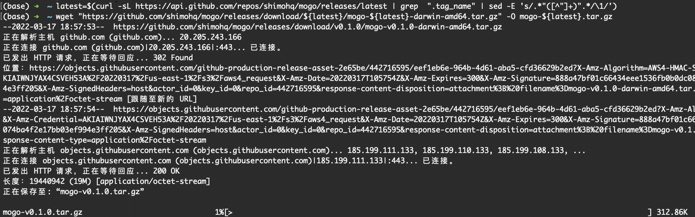

# 二进制安装

二进制安装支持四种架构：darwin-amd64、linux-amd64、darwin-arm64、linux-arm64。


## Mac AMD64 架构

```
# 获取最新版本
latest=$(curl -sL https://api.github.com/repos/clickvisual/clickvisual/releases/latest | grep  ".tag_name" | sed -E 's/.*"([^"]+)".*/\1/')

# MacOS amd64系统
wget "https://github.com/clickvisual/clickvisual/releases/download/${latest}/clickvisual-${latest}-darwin-amd64.tar.gz" -O clickvisual-${latest}.tar.gz
```



## Linux AMD64 架构
```
# 获取最新版本
latest=$(curl -sL https://api.github.com/repos/clickvisual/clickvisual/releases/latest | grep  ".tag_name" | sed -E 's/.*"([^"]+)".*/\1/')

# Linux amd64系统
wget "https://github.com/clickvisual/clickvisual/releases/download/${latest}/clickvisual-${latest}-linux-amd64.tar.gz" -O clickvisual-${latest}.tar.gz
```
## Mac ARM64 架构
```
# 获取最新版本
latest=$(curl -sL https://api.github.com/repos/clickvisual/clickvisual/releases/latest | grep  ".tag_name" | sed -E 's/.*"([^"]+)".*/\1/')

# Mac arm64系统
wget "https://github.com/clickvisual/clickvisual/releases/download/${latest}/clickvisual-${latest}-mac-arm64.tar.gz" -O clickvisual-${latest}.tar.gz
```

## Linux ARM64 架构
```
# 获取最新版本
latest=$(curl -sL https://api.github.com/repos/clickvisual/clickvisual/releases/latest | grep  ".tag_name" | sed -E 's/.*"([^"]+)".*/\1/')

# Linux arm64系统
wget "https://github.com/clickvisual/clickvisual/releases/download/${latest}/clickvisual-${latest}-linux-arm64.tar.gz" -O clickvisual-${latest}.tar.gz
```

## 启动 clickvisual
```
# 解压压缩包
mkdir -p ./clickvisual-${latest} && tar -zxvf clickvisual-${latest}.tar.gz -C ./clickvisual-${latest}

# 修改配置文件 config/default.toml，将 MySQL、Redis 等配置改成你自己的配置。
# 修改完配置文件后，使用如下指令运行 clickvisual
cd ./clickvisual-${latest} && ./clickvisual -config config/default.toml

# 访问 http://localhost:19001
# login username: clickvisual
# login password: clickvisual
```