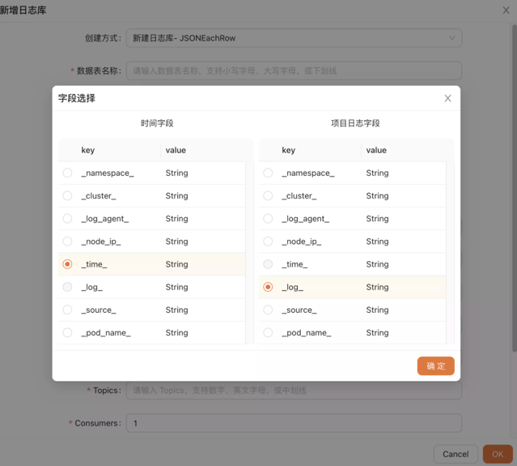
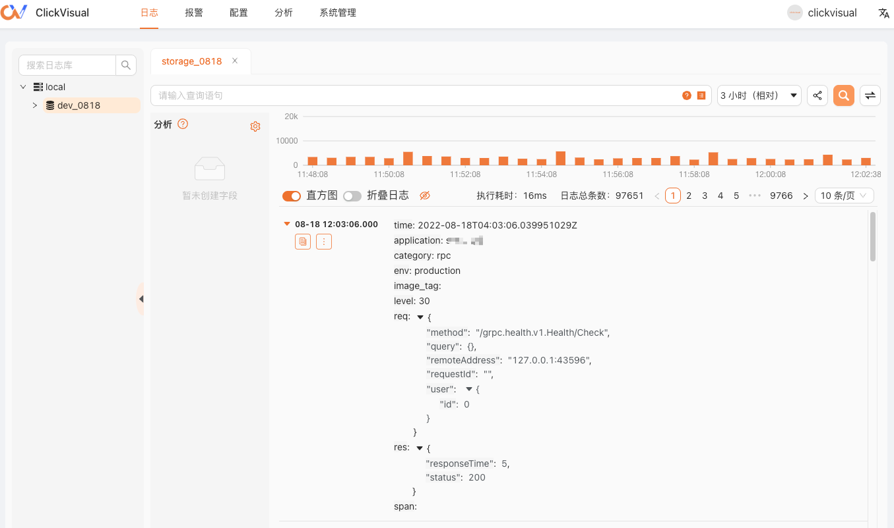

# 快速上手
本文主要是帮助你快速了解 ClickVisual，查询你的日志信息。想要更多了解 ClickVisual，请参考：什么是 ClickVisual。

## 第一步：安装 ClickVisual

ClickVisual 可以安装在不同种类的操作系统上，并且可以使用二进制、Docker 形式安装，请参考：安装介绍。


## 第二步：初始化 ClickVisual 数据库
初次安装 ClickVisual，需要初始化数据库，访问 http://localhost:19001/install/init  
对已有数据库进行版本更新的情况下，访问 http://localhost:19001/api/v1/migration


点击『数据库初始化』按钮，等待片刻，直至页面提示初始化完成。


## 第三步：登录
打开浏览器并访问：http://localhost:19001/user/login。  
在登录页面，输入默认账号/密码：clickvisual/clickvisual。

## 第四步：添加 ClickHouse 实例
在顶部导航栏，访问 系统设置 -> 实例管理，准备添加新的 ClickHouse 实例。  


## 第五步：添加数据库
回到日志页面，右键点击实例，弹出菜单，创建数据库。  


## 第六步：创建日志库

### 快速接入
选择 JSONAsString 方式新建日志库，这是一种简易模式，对日志采集格式没有要求，只要是 JSON 就可以完成写入，日志展示需要的时间轴字段也可以使用 Kafka 提供的采集时间。

- 是否为链路日志库
  - 支持 OTEL jaeger_json 导出类型，对于改类型会支持独有的的链路 UI 交互；

- 使用系统时间
  - 是：默认使用 kafka 采集时间
  - 否：输入对于时间字段，选择正确类型


### 常规接入
选择 JSONEachRow 的方式新建日志库，进一步的了解这个方式需要明确两个定义：
- 基础属性字段：例如 pod 名称、node 名称、集群信息等，由日志采集工具产生的固定基础数据；
- 采集必须字段：
  - 时间字段，日志展示的时间轴字段，支持 string、float 两种类型；
  - 项目日志字段， 具体服务产生的业务日志，支持 string 类型；

```
{
    // 基础属性字段
    "_source_": "stdout",
    "_pod_name_": "nginx-ingress-controller-internal-565449885b-c27hv",
    "_namespace_": "kube-system",
    "_cluster_": "xxx",
    "_log_agent_": "fluent-bit-kpnmz",
    "_node_ip_": "xx.xx.xx.xx",

    // 采集必须字段
    "_time_": "2022-09-08T09:29:06.941368Z",
    "_log_": "{\"time\": \"2022-09-08T17:29:06+08:00\", \"client_ip\": \"xx.xx.xx.xx\", \"method\": \"GET\", \"url\": \"/static/js/2.dc02066e.chunk.js\", \"version\": \"HTTP/2.0\", \"status\": \"200\", \"body_bytes_sent\": \"538283\", \"http_user_agent\": \"Mozilla/5.0 (Macintosh; Intel Mac OS X 10_15_7) AppleWebKit/537.36 (KHTML, like Gecko) Chrome/105.0.0.0 Safari/537.36\", \"request_length\": \"49\", \"request_time\": \"0.189\", \"upstream_status\": \"200\", \"req_id\": \"334bc867425106ad15eb815e2bb7a4da\"}",
}
```
例如上面的例子: 
- 选择 `_time_` 作为时间字段
- 选择 `_log_` 作为项目日志字段

这两个字段的选择可以在配置的时候自行决定。



- Brokers：填入 docker 中的 kafka 配置：kafka:9092
- Topic：kafka 中采集日志的 Topic Name 是 ingress-stdout

## 第七步：查询日志
访问 http://localhost:19001/query ，此时我们已可以看到日志。



增加分析字段
由于尚未创建分析字段，所有字段的背景色都是灰色的，此时我们只可以使用模糊搜索，但性能不是很好，所以我们需要按照下图创建分析字段。


创建完分析字段后，我们在按照第五步插入几条日志，就可以根据分析字段查看日志：


