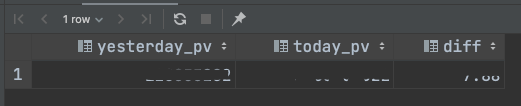
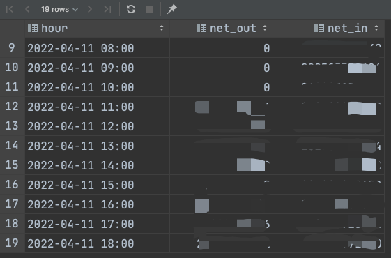
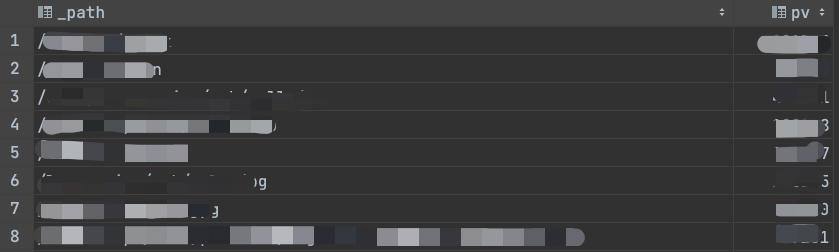
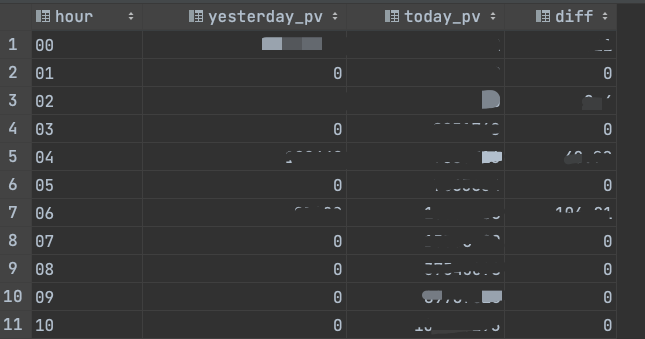
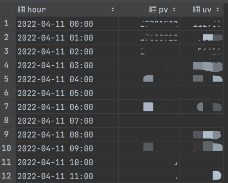
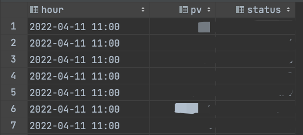
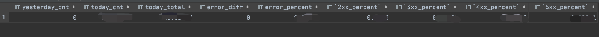

# 常用 SQL

## 今日 PV

```sql
with (
    select count(1) from ingress_stdout where toDate(_time_second_) = addDays(toDate(now()), -1)
) as yesterday_pv
select yesterday_pv, count(1) as today_pv, round((today_pv - yesterday_pv) / yesterday_pv, 2) as diff
from ingress_stdout
where toDate(_time_second_) = toDate(now());
```



## 流入流出

```sql
select concat(formatDateTime(_time_second_,'%Y-%m-%d %H'),':00') as hour ,
      SUM(if(body_bytes_sent is null, 0, body_bytes_sent)) as net_out,
      SUM(if(request_length is null, 0, request_length)) as net_in
from ingress_stdout
where toDate(_time_second_) = toDate(now())
group by hour
order by hour limit 24;
```



## TOP10 访问 path

```sql
select path(url) as _path, count(1) as pv
from ingress_stdout
where _time_second_ >= addMinutes(now(),-15)
and _path is not null
group by _path
order by pv desc limit 10;
```



## PV 趋势同比昨日（按时段）

```sql
select today._hour as hour,
       yesterday.pv as yesterday_pv,
       today.pv as today_pv,
       round((today_pv - yesterday_pv) / yesterday_pv,2) as diff
from
(select count(1) as pv, formatDateTime(_time_second_,'%H') as _hour from ingress_stdout where toDate(_time_second_) = toDate(now()) group by _hour) today
left join
(select count(1) pv, formatDateTime(_time_second_,'%H') as _hour from ingress_stdout where toDate(_time_second_) = addDays(toDate(now()), -1) group by _hour) yesterday
on today._hour=yesterday._hour
order by today._hour
;
```



## PV、UV 展示

```sql
select
       concat(formatDateTime(_time_second_,'%Y-%m-%d %H'),':00') as hour,
       count(1) as pv,
       count(distinct x_forward_for) as uv
from ingress_stdout
where toDate(_time_second_) = toDate(now())
group by hour
order by hour
;
```



## 请求状态展示

```sql
select concat(formatDateTime(_time_second_,'%Y-%m-%d %H'),':00') as hour,
       count(1) as pv,
       status
from ingress_stdout
where toDate(_time_second_) = toDate(now())
and status is not null
group by hour,status
order by hour;
```



## 请求数和各状态码比例

```sql
with (
select count(1) from ingress_stdout where toDate(_time_second_) = addDays(toDate(now()), -1) and status >= 400
) as yesterday
select
      yesterday                                         as yesterday_cnt,
       count(if(status >= 400, 1, null))                as today_cnt,
       count(1) as today_total,
       if(yesterday_cnt=0,0,round((today_cnt-yesterday_cnt)/yesterday_cnt, 2)) as error_diff,
       round(today_cnt/today_total, 5) as error_percent,
       round(sum(if(status >= 200 and status < 300, 1, 0)) / today_total, 5) as "2xx_percent",
       round(sum(if(status >= 300 and status < 400, 1, 0)) / today_total, 5) as "3xx_percent",
       round(sum(if(status >= 400 and status < 500, 1, 0)) / today_total, 5) as "4xx_percent",
       round(sum(if(status >= 500 and status < 600, 1, 0)) / today_total, 5) as "5xx_percent"
from ingress_stdout
where toDate(_time_second_) = toDate(now())
and status is not null
```


