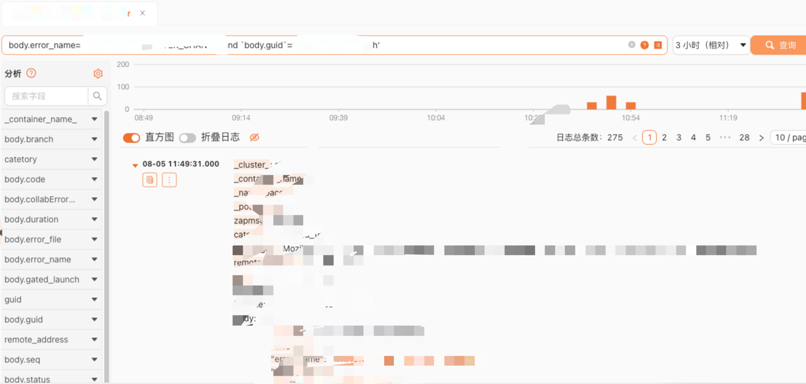

# 日志检索

日志查询条件筛选部分使用的 ClickHouse 原生 Where 子句语法。

[官方文档](https://clickhouse.com/docs/zh/sql-reference/statements/select/where)

## 从阿里云迁移过来后的使用案例

例如我们以前利用阿里云的模糊匹配进行搜索，以下语句会对这两个条件进行模糊匹配

`Electron and docs_text_copy`

那么在 ClickVisual 中如何使用呢，在默认情况下（通过 ClickVisual 建立整套的数据采集流程），使用以下语句进行模糊匹配可以达到相同效果

`_raw_log_ like '%Electron%' and _raw_log_ like '%docs_text_copy%'`

但是这样性能不太好，那么可以设置分析字段来提升查询效率  
假设我们匹配的目标字段在嵌套的 json 中：body 内的 browserName 和 code 字段。如下图

如果在左侧的分析界面看到了如下的配置，可直接使用以下语句进行查询

`body.browserName='browserName' and body.code='docs_text_copy'`

如果没有配置分析字段，则需要进行相关的配置

完成配置后，查询语句为：

`body.browserName='browserName' and body.code='docs_text_copy'`

这种情况下查询依旧很花时间，感觉很慢，可以开启下面的配置，这里设置 siphash 和 urlhash(会截断?后的参数进行hash)，通过建立 hash 映射，提升查询效率。

查询语句依旧是：

`body.browserName='browserName' and body.code='docs_text_copy'`

