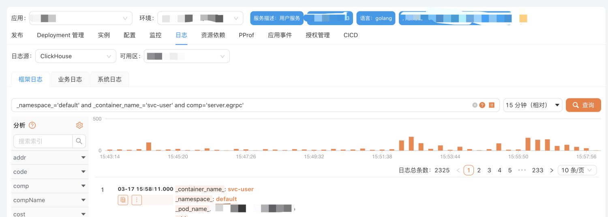

# Auth Proxy

你可以将 clickvisual 配置为让 HTTP 反向代理处理身份验证，通过这种方式你可以很方便的将 clickvisual 嵌入到其他系统里。下面我们详细介绍 auth proxy 的配置选项。


HTTP Proxy 配置：
```toml
[auth.proxy]
# Defaults to false, but set to true to enable this feature
enabled = true
# HTTP Header name that will contain the username or email
headerName = "X-WEBAUTH-USER"
rootTokenKey = "X-CLICKVISUAL-TOKEN"
rootTokenValue = "xxx"
```

使用 Curl 测试 clickvisual 的 AuthProxy 功能：
```sh
curl -H "X-WEBAUTH-USER: admin"  http://localhost:19001/api/v1/users/info
```

第三方系统通过 AuthProxy 嵌入clickvisual：

参数只需要填写 tid 即可，参考
> http://localhost:19001/share?tid=6



## 管理员模式
在 ClickVisual 的配置中配置 rootTokenKey 和 rootTokenValue 后，访问的 header 头中增加对应参数，这样的用户通过 proxy 方式登录后默认成为管理员。
```sh
curl -H "X-WEBAUTH-USER: admin" \
     -H "X-CLICKVISUAL-TOKEN: xxx" http://localhost:19001/api/v1/users/info
```
