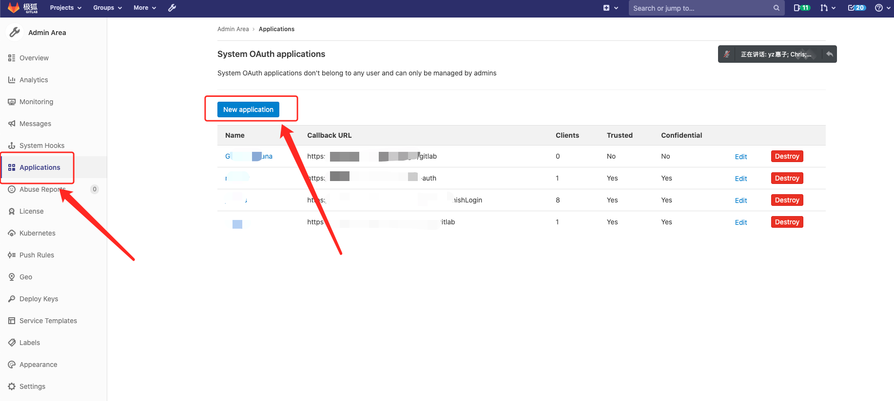
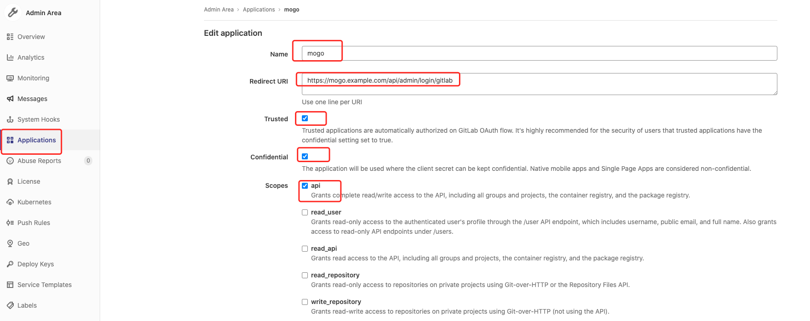
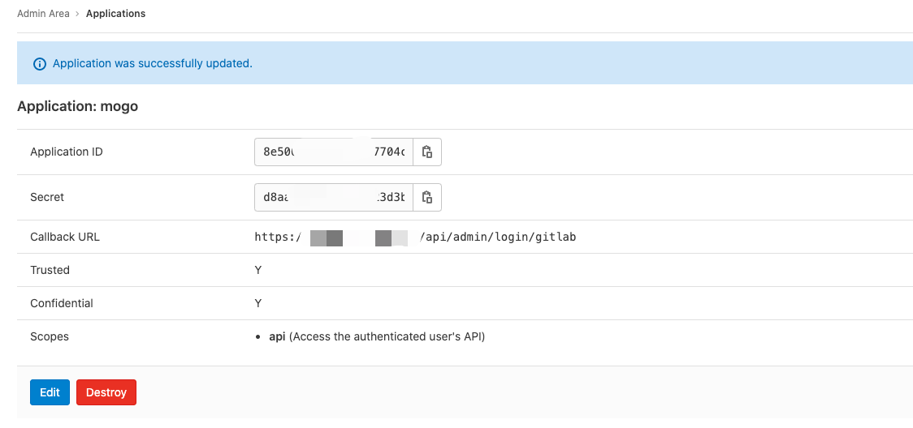
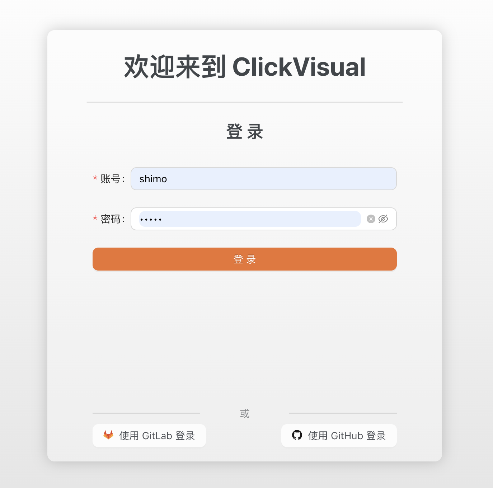

# GitLab Oauth2

clickvisual 支持对接 GitLab OAuth2，你需要在 GitLab 中注册应用程序。 GitLab 将生成一个客户端 ID 和密钥供 clickvisual 使用。

## 1. 创建 GitLab 密钥
假设你私有部署的 GitLab 域名是 mygitlab.com，clickvisual 域名是 clickvisual.example.com，流程可参考 GitLab 官方文档。


使用管理员角色账号，访问 https://mygitlab.com/admin/applications，左侧菜单选择 Application，右边页面点击 New Application。

image.png

填入需要新建的 Application 名称（比如 clickvisual），并使用 https://clickvisual.example.com/api/admin/login/gitlab 这个 Redirect URI（如果部署的 clickvisual 没有启用 HTTPS，也可使用 IP:Port 方式访问）。

image.png

提交创建 Application 表单后，返回的页面中会显示当前创建的 clickvisual Application 的 Application ID 和 Secret，注意保存 Application ID和 Secret，稍后会在 clickvisual 中配置。

image.png

## 2. 开启 GitLab 授权认证功能
   下面是在 clickvisual 本地配置中，开启 GitLab 授权认证的配置样例：
```
[app]
rootURL = "https://clickvisual.example.com/"　　　　　　　　　　　# 你的 clickvisual 域名

[[auth.tps]]
typ = "gitlab"　　　　　　　　　　　　　　　　　　　　　　　　 # 注意此处需要选择授权类型为 gitlab
enable = true
allowSignUp = true
clientId = "clickvisual_APPLICATION_ID"　　　　　　　　　　　　　 # 使用上文中获得的 Application ID
clientSecret = "clickvisual_SECRET"　　　　　　　　　　　　　　　　# 使用上文中获得的 Secret
scopes = ["api"]　　　　　　　　　　　　　　　　　　　　　　　# 授权范围和上文中配置保持一致，填 ["api"] 即可
authUrl = "https://mygitlab.com/oauth/authorize"　　　　# 注意此处替换为你的 GitLab 域名
tokenUrl = "https://mygitlab.com/oauth/token"　　　　　 # 注意此处替换为你的 GitLab 域名
apiUrl = "https://mygitlab.com/api/v4"　　　　　　　　　　# 注意此处替换为你的 GitLab 域名
allowedDomains = []
teamIds = []
allowedOrganizations = []
```

重启 clickvisual 服务，随后访问 https://clickvisual.example.com/user/login/，点击 『使用 GitLab 登录』，随后跳转到 GitLab 登录页面，即可完成 clickvisual 授权登录配置。

image.png