# ClickVisual 使用简介
## 1 引言

随着石墨文档的业务发展，业务和基础日志逐渐增加，伴随而来的是成本上升与查询效率问题；与此同时，私有部署环境下迫切需要部署低硬件要求的日志分析平台进行服务故障分析；还需要对海外与国内提供相同的日志查询分析体验，以降低交互学习使用成本，各类云平台提供的数据分析能力存在明显差异，自建基础的数据分析平台也需要尽快完成，以完成各种环境下的数据分析场景需求。

## 2 需求分析

基于以上问题对日志平台提出了新的要求：云中立，多云环境统一架构，不依赖三方云平台进行部署，支持低硬件要求下的环境部署；低成本，原始日志存储低存储硬件消耗，实时查询分析低 CPU 消耗；高性能，保证 P90 查询在秒级。

### 2.1 数据库选型

从查询能力/存储性价比/分析能力/分析性价比等方面横向对比 Loki、Hive、ClickHouse、Elasticsearch 这四个数据库。

* Hive 数据仓库，优势在数据分析，实时查询无法满足性能要求；
* Loki 日志聚合系统，由 Grafana Lab 推出的轻量级数据库，极高的数据存储性价比，适用于量级较小且无明确数据分析需求的场景；
* ClickHouse 列式存储计算分析数据库，查询效率极高和数据分析能力优秀，存储性价比相对 ElasticSearch 具有一定的优势，使用类 SQL 查询语句，学习门槛低；
* ElasticSearch 基于 Lucene 的搜索引擎，在存储内存充足的情况下具有出色的高并发查询能力，增加了倒排索引，提供了行存和列存导致存储性价比降低，没有向量化能力，数据分析受限于二段查询，DSL 查询语法有一定的学习门槛。
  |    |**查询能力**|**存储性价比**|**分析能力**|**分析性价比**|
  |:----|:----|:----|:----|:----|
  |Hive|中|中|高|中|
  |Loki|低|高|低|低|
  |ClickHouse|高|中|高|中|
  |ElasticSearch|高|低|中|高|

基于以上几个维度分析，ClickHouse 相对是最均衡的：拥有千亿级数据的秒级查询效率、出色的数据分析报表产出能力、更低的存储成本。因此决定采用 ClickHouse 作为日志存储数据库。

### 2.2 上线效果

在后续的一个月内完成了日志分析平台的开发与部分线上日志迁移工作，整体成本下降 60%，并且保证了 P90 查询延迟在秒级。

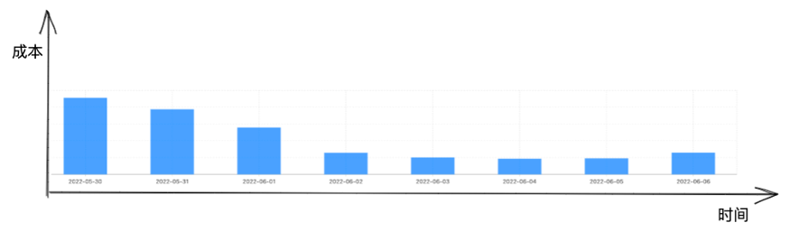

## 3 ClickVisual 开发

完成日志库的迁移工作并非只是完成原始日志文件存储的迁移，还需要保证在整个迁移过程中的新日志查询平台的功能与体验。

结合现有的具体业务需求，进行基于 ClickHouse 的类 Kibana 的轻量级高性能日志分析平台 Clickvisual 的开发，开源地址为 [https://github.com/clickvisual/clickvisual](https://github.com/clickvisual/clickvisual) 截止 2022 年 9 月 8 日 Fork 127/ Star 826，并被 ClickHouse 官方收录 [https://clickhouse.com/docs/zh/interfaces/third-party/gui#clickvisual](https://clickhouse.com/docs/zh/interfaces/third-party/gui#clickvisual)。

### 3.1 简介

为什么选择自研：在选择使用 ClickHouse 进行存储日志进行相关组件功能调研的时候，了解到社区并没有比较成熟的基于 ClickHouse 的类 Kibana 日志分析检索平台，如果选择自研可以借助实际的业务场景更好的进行功能验证，进一步为社区提供可靠性和实用性更高的开源产品。

结合目前的日志平台功能，总结了一下三个方面的开发重点：

    1. 存储检索，提供完整的日志采集、存储方案，以及易用的查询功能；
    2. 日志告警，支持基础告警和聚合告警；
    3. 数据分析，跨数据源同步、多表依赖解析、DAG 流式操作；
### 3.2 存储检索

本章将结合具体的日志案例介绍基于 ClickHouse 的单机和集群模式下的日志采集、存储和检索。

#### 3.2.1 核心流程

##### 3.2.1.1 单机模式

使用任意日志采集工具进行日志采集，案例中使用的是 Fluent Bit，将采集到的数据写入 Kafka，ClickHouse 消费 Kafka 中的日志数据，再通过物化视图将数据转换到 MergeTree Table中。

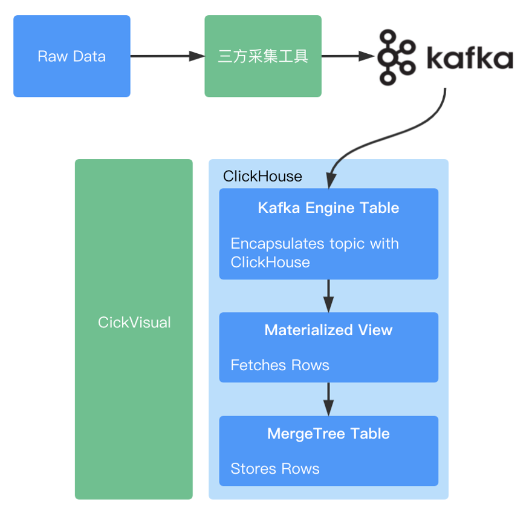

1. 安装 Fluent Bit，调整日志采集相关配置，将采集到的日志写入 Kafka；
2. 在 ClickVisual 上增加 ClickHouse 实例配置，依次创建数据库、日志库（Kafka Engine Table/Materialized View/MergeTree Table）；
3. 日志数据经过上图的数据流转最后落到 MergeTree Table 中；
4. 利用 ClickVisual UI 进行日志检索；

##### 3.2.1.2 集群模式

在线上环境会使用到 ClickHouse 的集群模式，通过 ClickVisual 创建日志库的主体流程没有变化，在最终的日志落地库进行了调整，日志存储从 MergeTree Table 调整为 Distributed Table 加上 ReplicatedMergeTree Table。

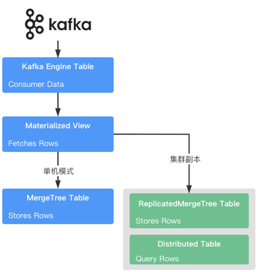

#### 3.2.2 接入案例

例如采集日志格式如下所示：

```plain
{
    "_pod_name_": "nginx-ingress-controller-internal-565449885b-c27hv",
    "_namespace_": "kube-system",
    "_cluster_": "xxx",
    "_log_agent_": "fluent-bit-kpnmz",
    "_node_ip_": "xx.xx.xx.xx",
    "_time_": "2022-09-08T09:29:06.941368Z",
    "_log_": "{\"time\": \"2022-09-08T17:29:06+08:00\", \"client_ip\": \"xx.xx.xx.xx\", \"method\": \"GET\", \"url\": \"/static/js/2.dc02066e.chunk.js\", \"version\": \"HTTP/2.0\", \"status\": \"200\", \"body_bytes_sent\": \"538283\", \"http_user_agent\": \"Mozilla/5.0 (Macintosh; Intel Mac OS X 10_15_7) AppleWebKit/537.36 (KHTML, like Gecko) Chrome/105.0.0.0 Safari/537.36\", \"request_length\": \"49\", \"request_time\": \"0.189\", \"upstream_status\": \"200\", \"req_id\": \"334bc867425106ad15eb815e2bb7a4da\"}"
}
```
将以上格式的日志接入 ClickVisual 有两种方式
* JSONAsString：将以上日志整体存入一个字段，在写入 Kafka Engine Table 过程中不考虑解析问题；
* JSONEachRow：将以上日志解析后，字段一一对应的存入 Kafka Engine Table 中；

##### 3.2.2.1 快速接入

选择 JSONAsString 方式新建日志库，这是一种简易模式，对日志采集格式没有要求，只要是 JSON 就可以完成写入，日志展示需要的时间轴字段也可以使用 Kafka 提供的采集时间。该模式下支持两种日志类型

* 任意类型，符合 JSON 格式即可；
* 链路日志，支持 OTEL jaeger_json 导出类型，对于改类型会支持独有的的链路 UI 交互；

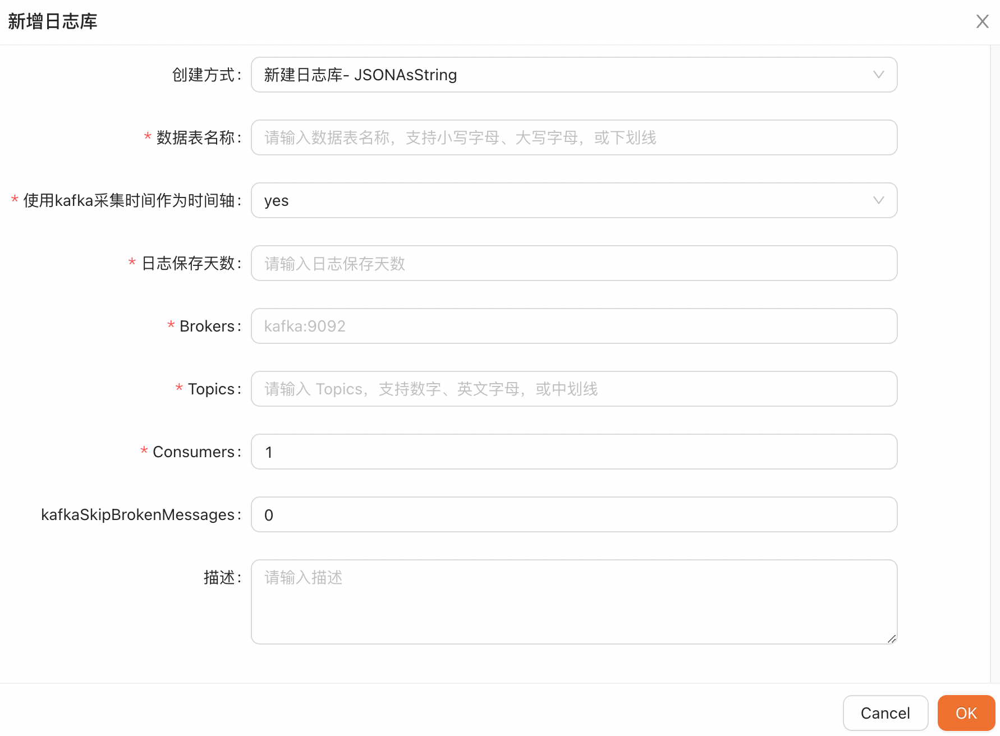

##### 3.2.2.2 常规接入

选择 JSONEachRow 的方式新建日志库，进一步的了解这个方式需要明确两个定义：

* 基础属性字段：例如 pod 名称、node 名称、集群信息等，由日志采集工具产生的固定基础数据；
* 采集必须字段：
    * 时间字段，日志展示的时间轴字段，支持 string、float 两种类型；
    * 项目日志字段， 具体服务产生的业务日志，支持 string 类型；

以下为 source 填写示例，填写后点击`转换`
```plain
{
	// 基础属性字段
    "_pod_name_": "nginx-ingress-controller-internal-565449885b-c27hv",
    "_namespace_": "kube-system",
    "_cluster_": "xxx",
    "_log_agent_": "fluent-bit-kpnmz",
    "_node_ip_": "xx.xx.xx.xx",

    // 采集必须字段
    "_time_": "2022-09-08T09:29:06.941368Z",
    "_log_": "{\"time\": \"2022-09-08T17:29:06+08:00\", \"client_ip\": \"xx.xx.xx.xx\", \"method\": \"GET\", \"url\": \"/static/js/2.dc02066e.chunk.js\", \"version\": \"HTTP/2.0\", \"status\": \"200\", \"body_bytes_sent\": \"538283\", \"http_user_agent\": \"Mozilla/5.0 (Macintosh; Intel Mac OS X 10_15_7) AppleWebKit/537.36 (KHTML, like Gecko) Chrome/105.0.0.0 Safari/537.36\", \"request_length\": \"49\", \"request_time\": \"0.189\", \"upstream_status\": \"200\", \"req_id\": \"334bc867425106ad15eb815e2bb7a4da\"}",
}
```
例如上面的例子，选择 `_time_` 作为时间字段，选择 `_log_` 作为项目日志字段，这两个字段的选择可以在配置的时候自行决定。

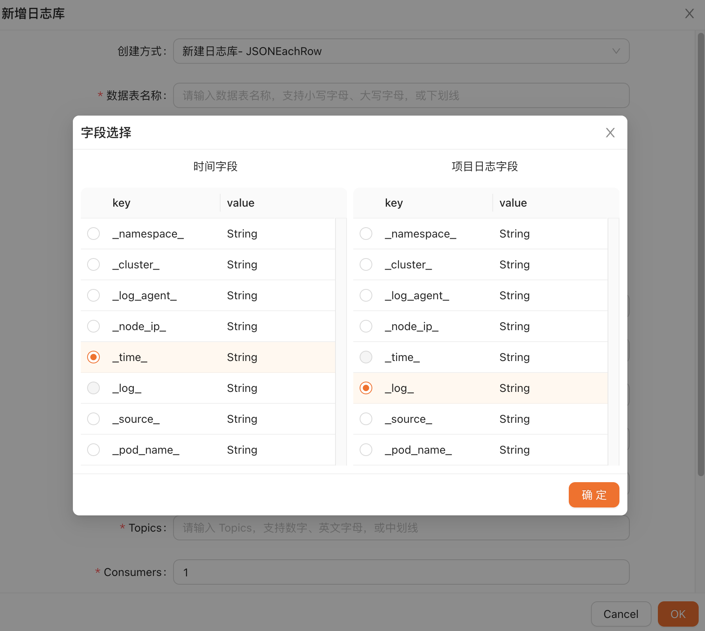

#### 3.2.3 日志类型

目前有两种日志类型：

* 链路日志，支持 otel 的 jaeger_json export 格式；
* 常规日志，常规的日志数据；

##### 3.2.3.1 链路日志

支持标准的 otel jaeger_json 格式。

```plain
{
    "traceId": "iPPp9rDchf72ApvzeS0a9g==",
    "spanId": "fmhAhIKvMbs=",
    "operationName": "hget",
    "startTime": "2022-09-08T07:44:01.199356883Z",
    "duration": "0.000138129s",
    "tags": [
        {
            "key": "otel.library.name",
            "vStr": "ego"
        }
    ],
    "process": {
        "serviceName": "xx-xx-api",
        "tags": [
            {
                "key": "host.name",
                "vStr": "xx-xx-api-85d9774d58-9nz44"
            }
        ]
    }
}
```
日志采集完成后会自动识别日志格式提供链路展示选项，并且在其他日志库配置关联的链路日志库后，可以通过选择链路 ID 的方式进行链路查询。

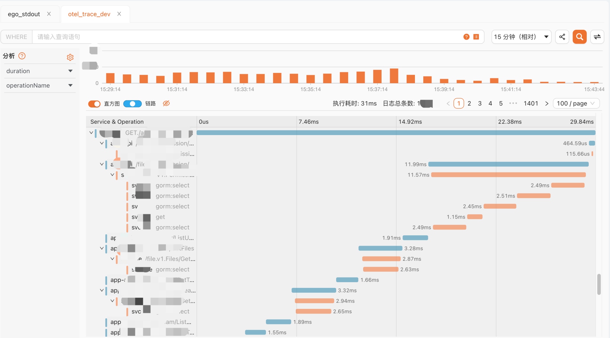

##### 3.2.3.2 常规日志

正常的业务日志/Nginx日志等，在搜索框输入 Where 部分的筛选条件，这里并没有进行自定义语法调整，使用原生语法的原因为了降低 ClickHouse 使用者的学习成本。

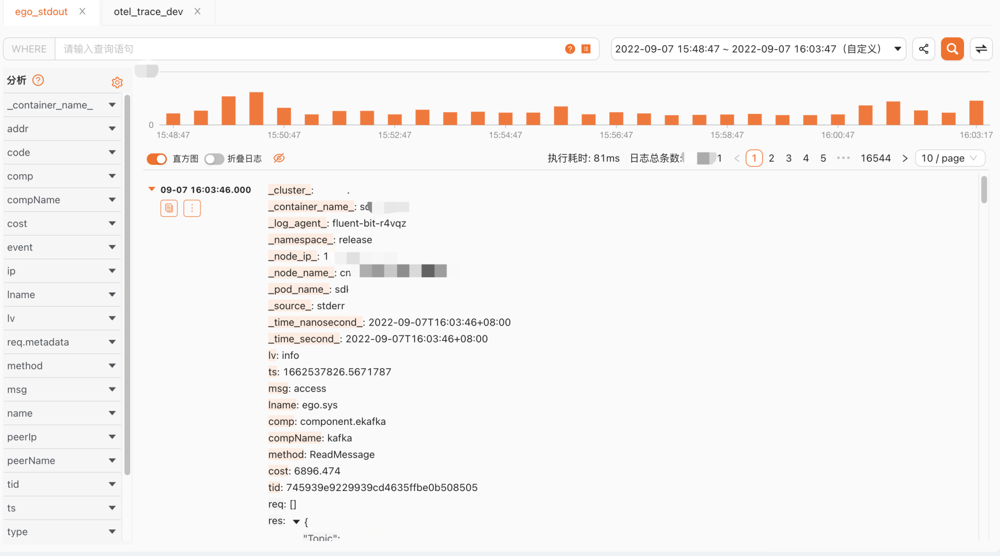

##### 3.2.3.3 已有表接入

接入已有数据表，选择实例->数据库->数据表，之后可以 ClickVisual 或自动获取符合条件的时间解析字段，目前可选的类型包括：Int32、UInt32、Int64、UInt64、Nullable(Int64)、DateTime、DateTime64(3)。可同时批量增加多个已有数据表。

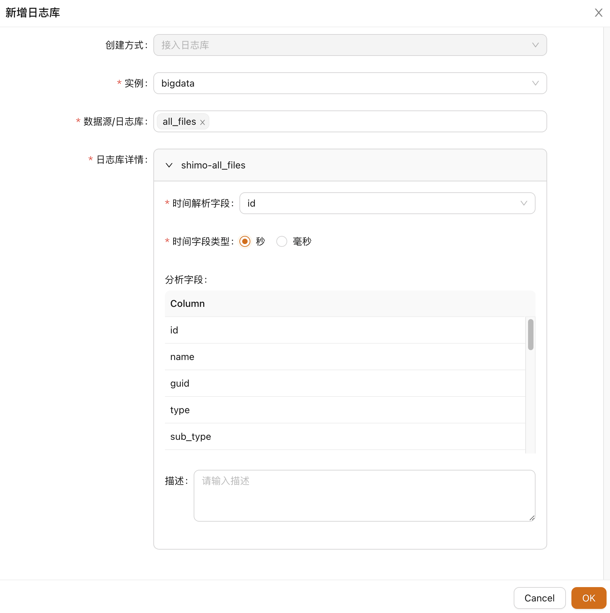

### 3.3 日志告警

#### 3.3.1 方案

目前有三种方案可以选择，分析个方案优缺点后，决定采用基于 Prometheus 的方案进行日志告警功能的开发。

* 自研，开发成本过高，无法复用社区已有组件；
* 基于 Grafana，依赖 Grafana 对 ClickHouse 数据读取插件，告警和图表强绑定；
* 基于 Prometheus，相对开发成本最低；
#### 3.3.2 处理过程

考虑整个告警流程，我们需要思考一下三个方面的问题：

* 数据转换，依据设置的告警规则对原始日志数据进行告警指标转换；
* 指标存储，将转换后的告警指标数据进行存储，需要考虑是存储到 ClickHouse 中，还是通过 ClickHouse 远程写入其他存储介质中；
* 指标读取，Prometheus 如何读取到 ClickHouse 产生的数据；
##### 3.3.2.1 数据转换

利用 ClickHouse 的 Materialized View 进行数据转换。对于简单的告警，例如监控是否出现 error 日志，直接使用 WHERE 条件即可实现。

```plain
SELECT
  toDate(_time_second_) as date,
  'clickvisual_alert_metrics' as name,
  array('uuid=b9e8ba1c-5d29-4a65-9abc-c59cc98f87f5') as tags,
  toFloat64(count(1)) as val,
  _time_second_ as ts,
  toDateTime(_time_second_) as updated
FROM dev.logs
WHERE lv='error'  GROUP by _time_second_;
```
对于复杂的依赖统计计算后进行的告警，例如统计全部 URL 在最近一小时内的访问次数超过 10w 次的 URL 列表并进行告警，通过 with 子句的方式完成告警的配置。
```plain
with(
	SELECT
	    count(1) AS val,
	    cutQueryString(url) as url
	FROM dev.logs
	WHERE ("_time_second_" >= toDateTime(NOW() - 3600)) AND ("_time_second_" < toDateTime(NOW()))
	GROUP BY url
	HAVING val >=100000 AND url not in('/api/log/xx','/access-xx')
	ORDER BY val DESC
	LIMIT 1
) as limbo 
SELECT
  toDate(_time_second_) as date,
  'clickvisual_alert_metrics' as name,
  array('uuid=2af511fb-b8ca-4d66-b640-22d7ad595841') as tags,
  toFloat64(limbo.1) as val,
  _time_second_ as ts,
  toDateTime(_time_second_) as updated
FROM dev.logs
GROUP BY _time_second_;
```
##### 3.3.2.2 指标存储

通过上一步产生的告警监控指标，有两种存储方式：通过程序读取数据写入 Prometheus；保持 ClickHouse 存储，让 Prometheus 直接读取 ClickHouse。

##### 3.3.2.3 指标读取

最后选择了直接让 Prometheus 直接读取 ClickHouse。转换后的告警指标直接写入 GraphiteMergeTree Table，间隔固定周期对数据进行计算去重，支持 sum/avg/max 等。

```plain
CREATE TABLE IF NOT EXISTS metrics.samples
(
    date Date DEFAULT toDate(0),
    name String,
    tags Array(String),
    val Float64,
    ts DateTime,
    updated DateTime DEFAULT now()
)ENGINE = GraphiteMergeTree(date, (name, tags, ts), 8192, 'graphite_rollup');
```
再对 ClickVisual 进行如下配置，可以支持 Prometheus（127.0.0.1:9222）对 ClickHouse（tcp://127.0.0.1:9000）的 metrics.samples 进行远程读写。
```plain
[prom2click]
enable = true

[prom2click.dev]
host = "127.0.0.1"
port = 9222
clickhouseDSN = "tcp://127.0.0.1:9000"
clickhouseDB = "metrics"
clickhouseTable = "samples"
```

#### 3.3.3 整体流程

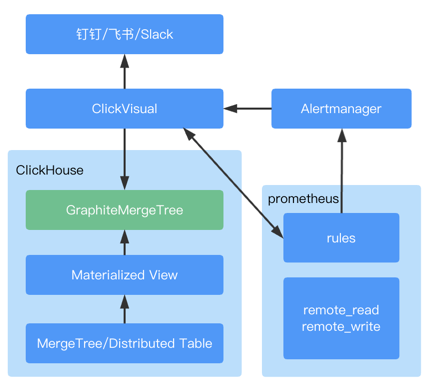

1. 配置告警渠道，目前可选渠道为钉钉/飞书/Slack；
2. 在 ClickVisual 中配置告警规则，即 Prometheus rules，下发到 k8s configmap 或文件目录中；同时创建物化视图，将原始数据转换后存入 metrics.samples 表；
3. 安装 Prometheus，在告警规则下发的同时 ClickVisual 会动态触发 Prometheus reload；
4. 在 ClickVisual 中增加远程读写配置，Prometheus 可对 ClickHouse 的 metrics.samples 表数据进行读取；
5. 安装 Alertmanager 用于接收用户配置的规则，根据规则触发告警，通过 webhook 方式将告警信号推送到 ClickVisual，再由亿配置的告警渠道完成推送；

### 3.4 数据分析

通过采集的日志数据，可以利用 ClickHouse 出色的分析能力进行数据处理，获取更有意义的归纳总结性数据，例如采集的 Nginx 日志可以绘制整体的监控数据，再借助 Grafana 看板进行展示；例如使用用户行为埋点日志进行分析，得出总结下数据转存其他数据库例如 MySQL，对产品升级提出建议。

各类型的使用场景都涉及到的是，数据来回的复制/计算/移动，核心功能是了解数据流向，并提供 UI 界面快速进行数据转换/计算/映射等功能。

#### 3.4.1 依赖解析

在数据分析的场景中，我们将一张表或者多张表的数据通过一个或几个或者几十个视图进行分析处理，导入到一个或几个新的结果表中，在实时业务流功能中，可以直观看到当前各类表之间的关系。

例如在集群环境下完成日志存储流程的配置后，可以查询到如下的表依赖关系。

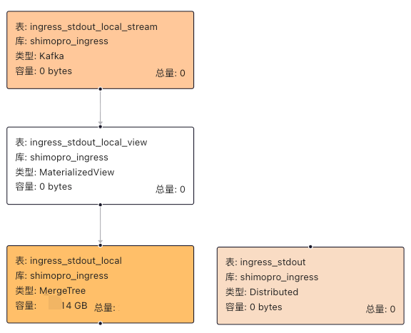

#### 3.4.2 SQL 运行

支持 MySQL 和 ClickHouse 的 SQL 创建/编辑/版本控制，并对运行结果进行记录，同时支持定时任务模式。

#### 3.4.3 数据同步

数据处理提供实时同步和离线同步两种方式：

* 实时同步，目标表的数据会实时经过规则处理后同步到目标表；
* 离线同步，基于定时任务进行周期性数据读取和处理后，同步到目标表；

#### 3.4.4 DAG 流图

在整个数据处理流程中会涉及多种 SQL 与多种数据同步方式，DAG 流图的作用是将整个数据处理流程可视化，并且可在该区域直接新增/编辑/删除节点。

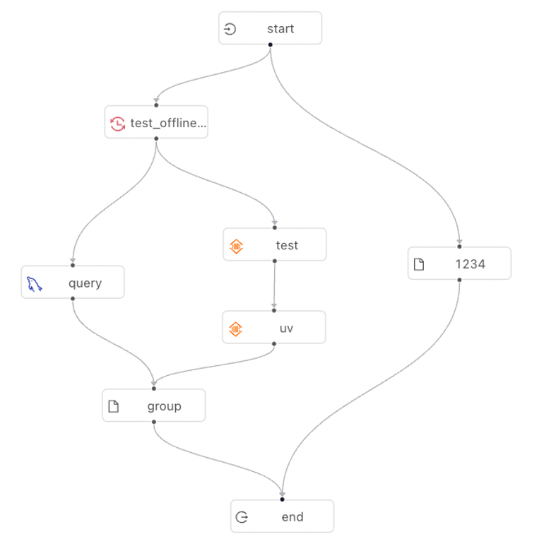

### 3.5 案例

通过采集 Nginx 日志并结合应用日志，借助数据分析流程创建对于物化视图完成数据计算，将计算后的数据写入 AggregatingMergeTree Engine 数据表中，最后通过 Grafana 完成大盘展示。

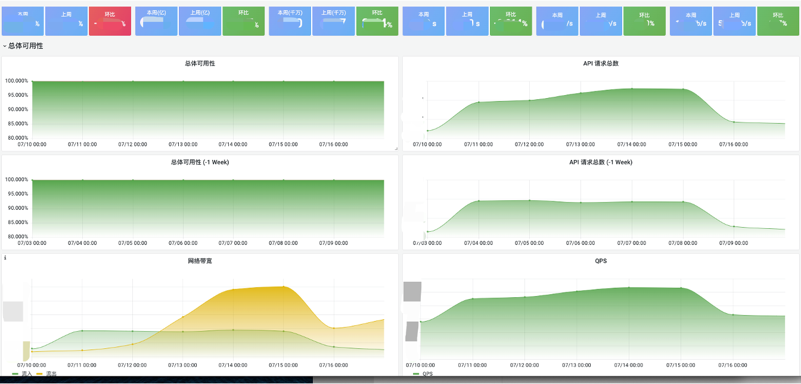

### 3.6 总结

以上为 ClickVisual 的三个方面基础功能介绍：

* 存储检索
* 日志告警
* 数据分析
* 
#### 3.6.1 流程图

日志数据（Raw Data）在 ClickVisual 中各功能模块下的流转如下图所示：

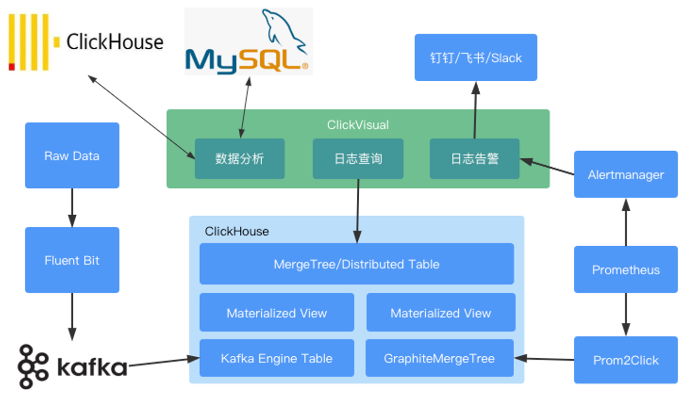

#### 3.6.2 架构图

整体架构图如下所示：

* 交互层，除了上文介绍的日志/告警/分析三个部分以外，ClickVisual 还支持对 k8s configmap 配置管理，可以作为简易的配置中心使用；
* 控制层，支持 Cashbin 权限配置，权限粒度可配置到表级别；
* 基础设施，依赖如下所示的六个基础组件，如果要使用完整功能缺一不可，如果不使用日志告警功能则可以不依赖 Prometheus 和 Alertmanager。

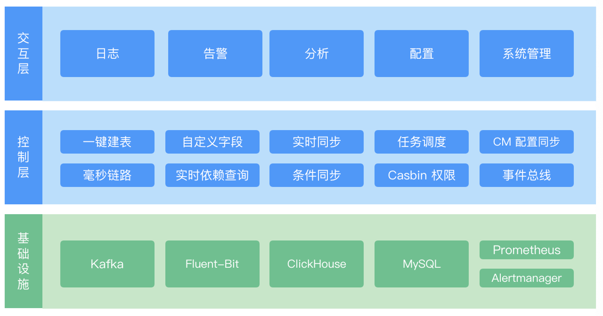

## 4 ClickVisual 优化

完成第一步基础功能开发后，进一步思考 ClickVisual 的优化方向：

* 交互，更友好的交互
* 成本，更低的存储成本
* 部署，更简化的部署模式
### 4.1 交互优化

#### 4.1.1 毫秒级链路

假如，线上某接口请求出现了异常情况，触发了报警，我们需要快速的定位问题触发的原因，找到整个接口访问链路上故障的点，由于链路上每个服务的操作通常在毫秒级别，如果只使用 DateTime 进行日志详情返回会产生乱序问题，因此对于采集阶段记录了高精度数据的日志会自动转换更高精度的时间数据存储到 _time_nanosecond_ 字段中，保证链路追踪阶段的日志顺序显示。

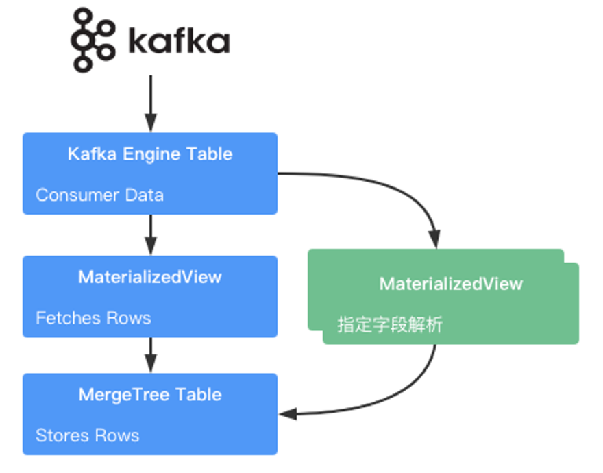

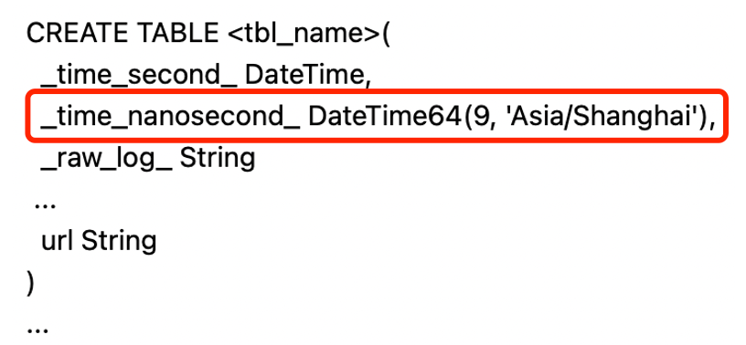

``

#### 4.1.2 可视区调整

日志查询展示的区域做了如下几点优化：

* 对分析字段只显示值的部分；
* 移除时间戳内的年份展示，扩大日志显示范围；
* 提供多种格式渲染，支持一键折叠/展开，并对日志所在行点击后展开显示全部日志数据。
#### 4.1.3 查询效率优化

根据前文的存储设计，日志的内容会全部存储到 _raw_log_ 字段中，日常使用中会遇到查询某个 URL 的调用的场景，例如查询 /access-token 的调用情况，此时检索框输入的查询语句为：

>_raw_log_ like '%/access-token%'
该查询语句会自动转换成一下内容后完成查询

>SELECT count(*) as count FROM `xx`.`xxx` WHERE _time_second_ >= toDateTime(1650267711) and _time_second_ < toDateTime(1650269511) AND _raw_log_ like '%/access-token%'
这样查询的问题很明显，ClickHouse 作为列式数据库的优势无法展现，所有的查询都变成了对于 ClickHouse 效率较低的全文检索。

##### 4.1.3.1 分析字段

利用 ClickHouse 对 JSON 数据完备的处理函数支持，将需要查询的 url 字段内容从 _raw_log_ 中提取出来，进行单独的字段存储，将全文检索变为精确匹配，以下操作可以通过 ClickVisual 进行分析字段的配置实现：

* 使用 JSONExtractString 函数，进行指定字段内容数据读取；
* 新增 Column 字段，存储 url 数据。

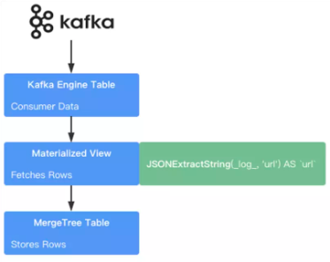

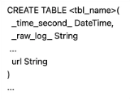

完成以上流程后，查询语句变成了：

>url='/access-token'
在日志查询框中输入该语句，点击查询到后端服务会转换成如下查询：

>SELECT count(*) as count FROM `xx`.`xxx` WHERE _time_second_ >= toDateTime(1650267711) and _time_second_ < toDateTime(1650269511) AND url='/access-token'
##### 4.1.3.2 替代查询

完成分析字段配置后，依旧会遇到查询耗时较长的问题，此时常见的优化方案为：

* 跳数索引配置
* 分片
  例如，在阿里云单副本 2 分片，磁盘空间 2000 GB，一天日志量级 7 亿，同时由于 url 包含了许多不同的参数，会导致该字段的匹配耗时大大增加，在完成以上两种优化之后，以下查询语句的单次耗时为 800ms。

>SELECT count(*) as count FROM `xx`.`xxx` WHERE _time_second_ >= toDateTime(1650267711) and _time_second_ < toDateTime(1650269511) AND url='/access-token'
考虑如何进一步优化查询效率，耗时较长的原因在于对该不定产字段扫描匹配导致，于是我们可以考虑构建一个定长的 int 类型数据进行替代查询，选择更少的存储字节数以降低查询过程中的磁盘 IO，来提升检索速度。

采用哈希函数对原始数据进行转换，例如 urlhash 和 siphash 两种类型。直接通过 URLHash 函数将不定长的 url 转换为定长的 UInt64，新增一个查询辅助字段，将 url='/access-token' 查询替换为 _inner_urlhash_url_=URLHash('/access-token')

>URLHash(JSONExtractString(_log_, 'url')) AS `_inner_urlhash_url_`

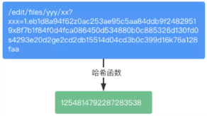

在 10 亿条数据的情况下，单次存储从 160 字节降低到 8 字节，利用额外 3G 的存储空间，将耗时从 800ms 缩短到 20ms，查询耗时降低了 40 倍。

#### 4.1.4 其他优化

* 在日志检索界面：并发请求、异步渲染；提供主动关闭趋势图渲染按钮；
* 后端查询优化 SQL，避免使用 * 进行 select 操作，因为查询过程中的性能损耗与字段数量正相关，优先使用 select _time_second_ 获取具体的日志事件点位后，使用此时获取的精确条件再增加 select 的字段进行数据读取；
* 合理利用 order by 和 limit 避免大量数据分区被扫描。
### 4.2 存储优化

调整数据存储的压缩算法，默认的压缩算法为 lz4，相同日志量下 zstd 具有更高的压缩率， 但在日志查询时需要消耗更多 CPU，目前对 _raw_log_ 字段采用 CODEC(ZSTD(1))，其他字段依旧使用 lz4

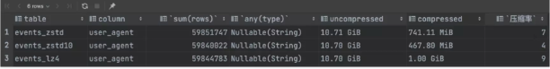

### 4.3 部署简化

* 二进制集成，采用 go:embed 将编译后的前端文件再次编译到 go 的二进制文件中，便于部署启动；
* 支持 Helm 部署，简化 Kubernetes 应用的部署和管理；
* 减少基础组件，Prom2Click & Alertmanager 集成，目前以及完成了 Prom2Click 组件的集成。

## 5 总结

Ego 主页：[https://ego.gocn.vip](https://ego.gocn.vip)

Ego 仓库： [https://github.com/gotomicro/ego](https://github.com/gotomicro/ego)

ClickHouse 官网：[https://clickhouse.com](https://clickhouse.com)

ClickVisual 主页：[https://clickvisual.net](https://clickvisual.net)

ClickVisual 仓库：[https://github.com/clickvisual/clickvisual](https://github.com/clickvisual/clickvisual)

ClickVisual 介绍：[https://github.com/clickvisual/clickvisual/blob/master/README.md](https://github.com/clickvisual/clickvisual/blob/master/README.md)


