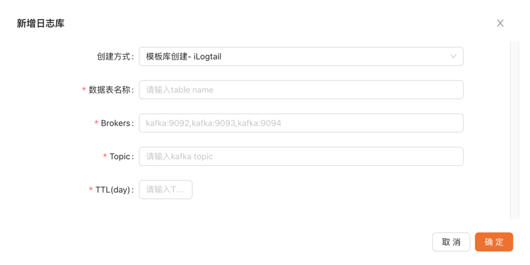

# iLogtail 配置参考

[官方文档](https://ilogtail.gitbook.io/ilogtail-docs/about/readme)


输出使用 [kafkaV2](https://ilogtail.gitbook.io/ilogtail-docs/data-pipeline/flusher/flusher-kafka_v2) 将日志数据发送至 Kafka

日志->kafka->clickhouse->clickviusal 的流程

## 具体流程

ilogtail configmap 目前只支持容器标准输出【service_docker_stdout】
```yaml
apiVersion: v1
kind: ConfigMap
metadata:
name: ilogtail-user-cm
namespace: ilogtail
data:
    config.yaml: |
        enable: true
        inputs:
            - Type: service_docker_stdout
        Stderr: true
        Stdout: true
        flushers:
            - Type: flusher_kafka_v2
        Brokers:
            - 192.XX.XX.1:9092
                  - 192.XX.XX.2:9092
                  - 192.XX.XX.3:9092
        Topic: KafkaTestTopic
```

写入 kafka 应该是如下数据结构
```json 
{
    "contents": {
        "_source_": "stderr",
        "_time_": "2023-04-17T04:07:17.624075074Z",
        "content": "{\"lv\":\"debug\",\"ts\":1681704437,\"msg\":\"presigned get object URL\"}"
    },
    "tags": {
        "container.image.name": "xxx",
        "container.ip": "127.0.0.1",
        "container.name": "xx-xx",
        "host.ip": "127.0.0.1",
        "host.name": "xx-xx-xx",
        "k8s.namespace.name": "default",
        "k8s.node.ip": "127.0.0.1",
        "k8s.node.name": "127.0.0.1",
        "k8s.pod.name": "xx-xx-xx-xx",
        "k8s.pod.uid": "xx-xx-xx-xx-xx"
    },
    "time": 1681704438
}
```

在 clickvisual 中选择该方式创建日志库即可


