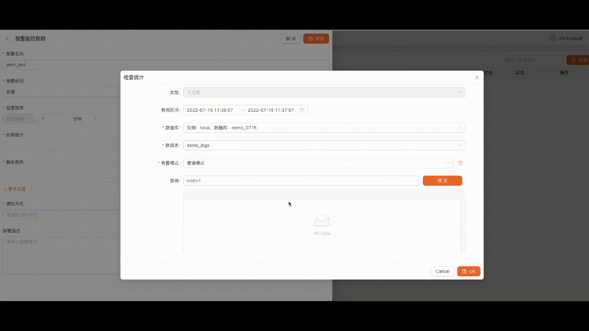

# 什么是 ClickVisual

ClickVisual 是一个轻量级的开源日志查询、分析、报警的可视化平台，致力于提供一站式应用可靠性的可视化的解决方案。既可以独立部署使用，也可作为插件集成到第三方系统。目前是市面上唯一一款支持 ClickHouse 的类 Kibana 的业务日志查询平台。

## 特性

* 支持可视化的查询面板，可查询命中条数直方图和原始日志。
* 支持设置日志索引功能，分析不同索引的占比情况。
* 支持可视化的 VS Code 风格配置中心，能够便捷地将 logagent 配置同步到 Kubernetes 集群 ConfigMap 中。
* 支持 GitHub 和 GitLab 授权登录。
* 支持 Proxy Auth 功能，能被被非常轻松的集成到第三方系统。
* 支持物理机、Docker、Kubernetes 部署。
* 支持基于 ClickHouse 日志的实时报警功能。

## 技术架构

## ClickVisual 使用效果

### 日志

### 告警

### 分析

### 场景支持

* 日志查询
* 日志报警
* 配置下发
* 数据分析
